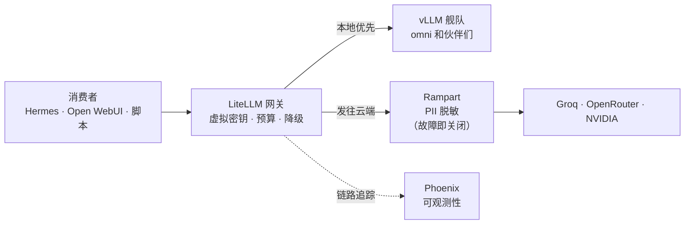

# LiteLLM：通往所有模型的一扇门

**这是什么：** [LiteLLM](https://github.com/BerriAI/litellm) 是一个 LLM 网关——一个单一的 OpenAI 兼容端点，挡在我能触达的*所有*模型前面：跑在自家 GPU 上的本地 vLLM 舰队，加上云服务商（Groq、OpenRouter、NVIDIA），供任务超出家里算力时使用。一个 URL，一种 API 形态，所有模型。

**我为什么推荐它：** 没有网关的话，每个应用、每个智能体都得认识每一个模型——它的地址、密钥、各种怪癖。那是 N×M 个集成点，而且毫无可见性。有了 LiteLLM，消费者只需要*一扇*门，而我得到了房东想要的一切：**按消费者发放的虚拟密钥和预算**（Hermes 智能体有自己的密钥和月度上限）、**降级链**（本地优先，需要时才上云）、存进真数据库的**开销跟踪**，以及每次调用都进 Phoenix 的**链路追踪**。新模型上线时，我把它加进网关，所有消费者立刻就能用——没有任何人的配置需要改动。

{/* screenshot: ai/litellm-ui-models.png — the admin UI model list, local + cloud side by side */}
{/* screenshot: ai/litellm-ui-spend.png — spend dashboard by key */}

## 日常主力

- **所有智能体调用**——Hermes、Open WebUI 聊天、各种临时脚本都只跟 LiteLLM 对话，从不直连模型
- **切换模型**不用动任何消费者——换掉默认模型，所有人自动跟上
- **看账单**——开销页面一眼回答"这个月智能体们花了多少钱？"
- **发密钥**——新项目一分钟内拿到自己的虚拟密钥和预算

## 流量怎么走

我最得意的细节：**发往云端的流量会先经过 [Rampart](./rampart.md)**——一个本地 PII 脱敏服务——而且这个耦合是*故障即关闭*（fail-closed）的。如果 Rampart 挂了，云端调用会被直接拦下，而不是不加清洗地发出去。本地调用永远不出家门，所以完全不用过这道安检。

## 这里的配置方式（有意思的部分）

LiteLLM 以数据库为后端运行（密钥、预算、开销都存在 Postgres 里，而不是配置文件），所以密钥管理在它的管理界面里完成，不在 git 里。网关自身的配置——有哪些模型、由哪些服务商支撑、降级顺序如何——才是真正的决策所在。有一条值得照抄的经验：**从第一天起就给每个消费者发独立密钥。** 等到某个智能体行为失常、或者某个项目需要预算的那一刻，你会庆幸爆炸半径和账单都是按密钥隔离的，而不是大家共用一把。

主密钥和其他所有凭据一样存在 Vaultwarden 里（参见[信任体系](../tissue/trust-fabric.md)）；各服务通过带外（out-of-band）的 Kubernetes secret 拿到自己的密钥。
