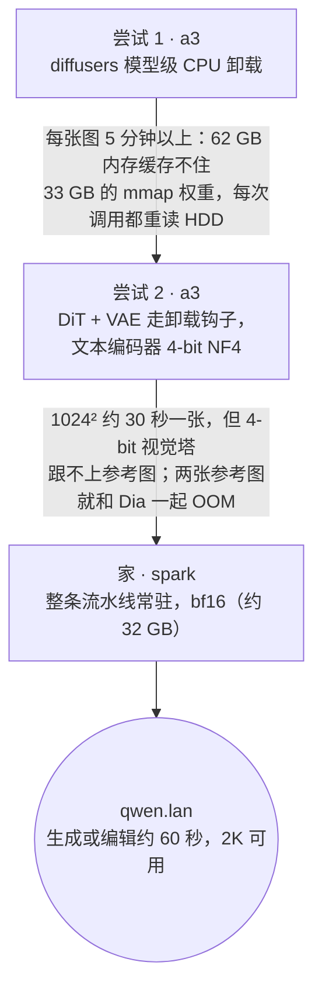

# Qwen-Image 2.1

**这是什么：** [Qwen-Image 2.1](https://huggingface.co/Qwen/Qwen-Image-2.1)，阿里巴巴的开放权重图像模型（2026-09-20 发布），由一个包着 diffusers `QwenImage21Pipeline` 的小 FastAPI 服务在 `https://qwen.lan` 上提供。一条流水线干四件事：文生图、基于最多十张参考图的编辑（在提示词里用"image 1、image 2……"指代它们）、区域引导编辑（在参考图上画个红圈，或者把遮罩当作第二张参考图传入），以及原生 RGBA 输出——提示词里写上"This is an RGBA image with transparency … the background is transparent"，拿到的就是货真价实的透明 PNG，不需要再抠一遍背景。

**我为什么要跑它：** 为了文字。我停在替补席上的每一个图像模型都能画出漂亮的画，然后把任何带字的东西糊成一团。Qwen-Image 能画出带价格的菜单、带对白的漫画、中英文同框的海报——而且在我的抽查里，文字一个字母都没错。这一点，再加上用一句话就能描述、不用拖节点图的编辑能力，值得我为它的安置折腾一番。

{/* screenshot: ai/qwen-image-showcase-grid.png — a 4×4 sample of the showcase gallery: bilingual menu, comic with lettering, RGBA sticker, multi-reference composite */}

## 盒子里装了什么

这个模型由三部分组成，它们的体积就是这一页的全部故事：

- **Qwen3-VL 9B** 文本/视觉编码器——bf16 下 **17.5 GB**。编辑之所以能成立全靠它：读提示词的那座塔，同时也在*看*参考图。
- 一个 **7B 单流 DiT**（32 层块因果层）——**14.2 GB**。
- 一个 **4 通道 VAE**——**1.4 GB**。第四个通道是 alpha；原生透明就是从这里来的。

在分配第一个激活值之前，就已经是 **33 GB 的权重**。默认 40 步、不用无分类器引导（`true_cfg_scale` 为 1；给一个负向提示词并把 scale 调到 1 以上就会打开）。许可证：Qwen Research License，非商用——对实验室来说没问题。

## 它住在哪里，以及为什么试了三次

一块 RTX 4090 有 24 GB。集群里没有任何一块卡装得下这条流水线，所以问题从来不是*哪块* 4090，而是*怎么作弊*——结果发现每一种作弊都要付出我并不想付的代价。

**尝试 1——a3，CPU 卸载。** diffusers 的 `enable_model_cpu_offload` 每次只把一个组件放在 GPU 上（峰值约 18 GB），装得下。问题是：每次调用都要把 33 GB 从 CPU 内存重新过一遍，而 a3——控制平面，62 GB 内存本来就很忙——根本缓存不住 33 GB 内存映射的 safetensors。于是"从 CPU 内存读"悄悄变成了"从 5400 转的机械硬盘读"。每张图五分钟以上。结果正确，没法用。

**尝试 2——a3，量化编码器。** 让 DiT 和 VAE 继续通过卸载钩子在 GPU 上轮换，把 Qwen3-VL 编码器压成 4-bit NF4（约 5.5 GB），这样整个工作集能放进内存、不碰磁盘。这一版确实不错：1024² 大约 30 秒一张，文生图效果极好。然后我让它编辑了一张图。

:::warning[🔥 War story]
编辑测试是一张写着"HOME LAB"的招牌照片，指令是*把招牌改成"GPU CLUB"*。尝试 2 返回的是同一张照片更粗糙的版本，上面还是"HOME LAB"。不是编辑错了——是根本没编辑。4-bit 的视觉塔还能*读懂*提示词，所以文生图看起来完美无缺，但它已经*看不清*参考图、无法据此行动了。量化并没有让模型均匀地变差一点；它恰恰打掉了我还没测过的那项能力。两张以上参考图直接把它推下悬崖——和同一块共享卡上的 Dia 一起 OOM——而这次 OOM 让 accelerate 的卸载钩子停在半路，之后的每次调用都跟着中毒，直到服务端把钩子复位。（这个复位现在写进了 [`server.py`](https://github.com/briancaffey/home-lab/blob/main/services/qwen-image/server.py)。）我记下的教训是：**量化那个你输得起的组件，并且要测你真正想要的功能，而不是那个最容易演示的。**
:::

**家——spark。** DGX Spark 的 GB10 有 128 GB 统一内存，整条流水线以 bf16 常驻（约 32 GB），不换入换出，不量化。1024² 一张图*或*一次编辑约 60 秒，多参考图合成可用，原生 2K 可用。每一步比 4090 慢——它不是一块快的 GPU——但它是这里唯一能把整件事做完的机器。[节点页](../hardware/nodes.md)过去说 spark "不跑任何关键服务"；现在它跑着那个别的机器都跑不了的模型。

a3 那一版保留为 [`services/qwen-image/a3-fallback/`](https://github.com/briancaffey/home-lab/tree/main/services/qwen-image/a3-fallback)——仅限文生图，spark 离线时手动 `kubectl apply -k` 上去，用完删掉。

## 把 33 GB 通过 WiFi 搬到一台 ARM 机器上

搬这些权重的过程没有一步是优雅的，我宁愿老实写下来，也不假装不是这样。

- **a3 自己的下载**走它的 WiFi，约 9 MB/s，而一个 4.4 GB 的 PyTorch 镜像拉取途中不断被截断。所以两个 Pod 都不用自定义镜像：a3 备用版复用那里已经缓存的 `ltx2-comfy` 镜像，spark 复用它已有的 arm64 版 `vllm/vllm-openai:nightly`（Python 3.12，较新的 torch）。两者都在启动时 `pip install` 其余依赖，配一个 hostPath 的 pip 缓存，重启只花几秒而不是重新下载。
- **spark 的上行只有约 3 MB/s**，所以它从来没有自己下载过模型。我把 a3 的那份通过我的笔记本以约 8 MB/s 中转过去——笔记本到两台机器的链路，比它们互相之间的链路都好。`hf download` 仍然在 Pod 启动时运行，但它是幂等的，缓存一旦填满，Pod 就能自给自足。
- **diffusers 按 commit SHA 钉在一个 main 分支的 tarball 上**，因为 2.1 流水线的支持晚于 0.40 发布版。Renovate 不会去升它，得靠人。

这一切都是[硬件页](../hardware/nodes.md)上那笔"纯 WiFi 集群税"，一个下午一次付清。

## 服务方式

服务端是一个通过 ConfigMap 挂载的 `server.py`——asyncio 锁后面一次只跑一个生成任务，启动时先跑一次预热生成，只有真正渲染出一整张图之后 `/health` 才变绿，PNG 既存到节点的输出目录也以 base64 返回。

| 端点 | 形态 | 谁在用 |
|---|---|---|
| `POST /v1/generate` | 原生 JSON——提示词、base64 参考图、尺寸、步数、种子、文件名 | 我、脚本、展示集生成器 |
| `POST /v1/images/generations` | OpenAI 图像 API | inference.club 智能体 |
| `POST /v1/images/edits` | OpenAI multipart，`image[]` + `prompt` | 同上 |
| `GET /files/{name}` | 一张已保存的 PNG | 浏览输出 |

Service 带着和 flux2-klein 一样的 `inference-club.com/type: image` 标签和模型注解，所以智能体不改一行代码就能把它发现为 `input_modalities: [text, image]` 的图像端点。局域网上它是 `qwen.lan`（Traefik + mkcert 证书），Homepage 的 Inference 组里有它的磁贴（缩写 `QWN`），并作为 `svc-qwen-image` 这个 Argo CD Application 部署在 [`clusters/home/argocd/apps/home-services.yaml`](https://github.com/briancaffey/home-lab/blob/main/clusters/home/argocd/apps/home-services.yaml) 里——带着舰队统一的副本数 `ignoreDifferences`，停不停它仍由我说了算。

spark 上的 GPU 共享遵循[舰队页](./inference-fleet.md)的"君子协定"：不声明 `nvidia.com/gpu`，统一内存和那里其他醒着的东西（nemotron-asr、LM Studio）一起用。

## 展示集

为了搞清楚我到底搭出了什么，我跑了一个 44 条提示词的展示集，覆盖每一项能力：文字渲染（英文和中文、带价格的菜单、信息图、带对白的漫画）、写实摄影、艺术风格、原生 2K 和非正方形宽高比、计数与排版、RGBA 贴纸/logo/抠图、单参考图编辑（换背景、增删物体、换季节、改文字、重打光、外扩画面）、区域引导编辑、多参考图合成，以及一组 CFG 开/关对比。结果生成了一个画廊页面；简短的结论是：文字渲染在我检查的每一处都一个字母不差，而尝试 2 完全做不到的参考图编辑，是这个模型最有用的本事。

manifest：[`services/qwen-image/`](https://github.com/briancaffey/home-lab/tree/main/services/qwen-image)。Ingress 是 [`clusters/home/inference-lan/ingress.yaml`](https://github.com/briancaffey/home-lab/blob/main/clusters/home/inference-lan/ingress.yaml) 里的 `lan-qwen` 块。
