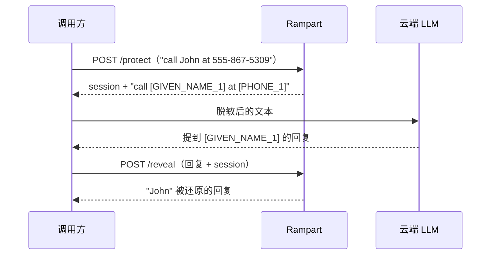

# Rampart：PII 保镖

**这是什么：** 一个小型本地服务，包装了 [nationaldesignstudio/rampart](https://huggingface.co/nationaldesignstudio/rampart) PII 脱敏模型——一个约 1900 万参数的 ONNX 模型，能在文本中找出姓名、邮箱和电话号码，并把它们换成占位符。它跑在 CPU 上（不需要 GPU），在 `rampart.lan` 有个小小的演练场界面，API 只有两个动词。

**我为什么需要它：** [LiteLLM 网关](./litellm.md)会把一部分流量发给云服务商，而我不希望个人信息跟着一起出门。Rampart 就站在这条路上，在任何东西离开局域网*之前*完成清洗。最关键的设计决定是**故障即关闭（fail-closed）**：如果 Rampart 挂了，发往云端的 LLM 调用会被*拦截*，而不是原文发出。会优雅降级的隐私保护不叫隐私——那叫建议。

{/* screenshot: ai/rampart-playground.png — the playground UI redacting a sample sentence */}

## 日常主力

- **隐形的守卫值勤**——每个发往云端的 LiteLLM 调用都要经过它；我对它的感知，基本就是感知不到它
- **演练场**——在 `rampart.lan` 贴一段文字，看着实体变成占位符；给客人演示它的功能特别好用
- **参考应用**——它的第二重身份（见下文）：实验室里所有 CI 流水线的模板

## 会话模型

`/protect` 负责脱敏，并把映射关系记在一个短命的内存会话里；`/reveal` 把真实值放回*响应*中。云端来回看到的都是占位符；人来回看到的都是真名。会话被有意设计成短暂的（一小时）——这张映射表就该蒸发。

## 第二重身份：CI 参考应用

Rampart 同时也是实验室里**发布代码的模范公民**。它的源码住在自己的 Forgejo 仓库里，每次推送都会跑完整个闭环：在集群内的 runner 上构建 → 打上标签的镜像（`harbor.lan/apps/rampart:<git-sha>`）→ 流水线把新标签提交进本仓库的部署 manifest → Argo CD 完成上线。全程没有人碰部署。以后有新应用需要 CI 时，答案就是"照 rampart 做"——完整故事在 [CI 闭环](../gitops/ci-loops.md)。

部署 manifest 留在 [`clusters/home/rampart/`](https://github.com/briancaffey/home-lab/tree/main/clusters/home/rampart)——由 GitOps 管理，文件头的注释会警告你别手改镜像标签，因为那一行现在归一个机器人管。
