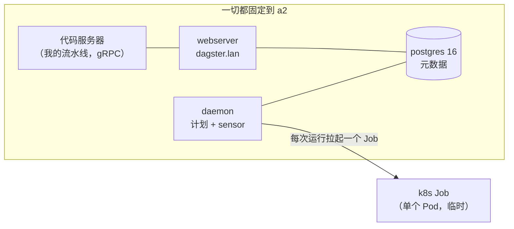
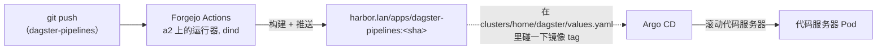

# Dagster：可编程的黏合层

**先说实在话。** Dagster 是一个数据编排器——你把流水线写成 Python 的"资产"（asset，即你希望存在的某个东西，比如一张表或一份报告），Dagster 会算出执行顺序，按计划或触发去跑，还给你一个 UI 盯着这一切。如果你听说过 Airflow，它是同一家族的，但以资产为先，界面也友好得多。我把它立成了一个**全新的服务类别**——*数据 / 编排*——因为它和实验室里其他所有东西都不是一类东西：它是运行*我写的代码*、按计划、面向我已经搭好的平台去执行的那一层。我的这台跑在 a2 上，地址 `https://dagster.lan`。

**我为什么想要它。** 到目前为止，实验室能*托管*东西、能*部署*东西，但没有一个地方安放"每天跑一段逻辑，然后拿结果做点事"。Dagster 就是这个地方。有意思的是它手边有什么可用：它能读我自己的 Prometheus、调我自己的 LLM 网关、从我自己的 Git 锻造场拉代码、还把每次作业跑成一个独立的 Kubernetes Job。它是平台之上的**可编程黏合层**——第一个整份工作就是去*使用*其他服务的服务。

**看看它长什么样。**

{/* screenshot: data/dagster-ui-assets.png — the Dagster asset graph for the GPU digest pipeline */}
{/* screenshot: data/dagster-run-k8s-jobs.png — the runs list, each run its own k8s Job */}

## 它是怎么接线的

平台部分位于 [`clusters/home/dagster/`](https://github.com/briancaffey/home-lab/tree/main/clusters/home/dagster)，由 Argo CD 应用 `home-dagster` 部署。它是官方的 `dagster/dagster` Helm chart（v1.13.13），通过 kustomize 的 `helmCharts:` 展开——和 open-webui 同一套路子，所以没有需要照看的 helm-CLI release。四个活动部件：

- **Webserver**——`dagster.lan` 上的 UI。
- **Daemon**——运行计划任务和 sensor（决定"到点了，上"的那个东西）。
- **K8sRunLauncher**——这是精彩的一个：**每次流水线运行都作为它自己的一个 Kubernetes Job 执行**。没有任何东西跑在长期存活的 worker 里；Dagster 为每次运行向集群要一个全新的 Pod，你就在 `kubectl get jobs` 里看着它们来来去去。这是对 k8s 原生编排一次相当漂亮的演示——编排器把执行直接下放给了调度器。
- **user-deployments gRPC 代码服务器**——一个独立的 Pod，装着*我的*流水线代码，并通过 gRPC 把它供给其余组件，于是我可以发布新流水线而不必重启 Dagster 本身。

元数据存储是一个朴素的 `postgres:16-alpine` Deployment（仓库惯例——我不用 chart 自带的 Postgres 子 chart），跑在固定到 **a2** 的 local-path PVC 上。有一处尖锐的边角值得在下面单独说。

## 流水线代码的 GitOps 环

Dagster 的*平台*住在 home-lab 仓库里，但*流水线*住在它们自己的仓库——Forgejo 上的 `brian/dagster-pipelines`——而且它们搭乘的正是实验室里其他每个应用都用的那套机器：

推送流水线代码 → Forgejo Actions 构建 `harbor.lan/apps/dagster-pipelines:<sha>` → 我通过在 [`clusters/home/dagster/values.yaml`](https://github.com/briancaffey/home-lab/tree/main/clusters/home/dagster) 里碰一下镜像 tag 来晋级它 → Argo 把代码服务器滚动到新镜像上。同一套 [CI 环](../gitops/ci-loops.md)、同一个 Harbor、同一个 Argo。Dagster 不需要一套新的部署故事——它直接插进了本来就在那儿的那套。

那个镜像有一个要求：它必须安装 `dagster-postgres` 和 `dagster-k8s`。Dagster 的集成库用的是比 core 落后一个固定偏移量的 `0.X.Y` 编号方案——**core `1.13.13` 就是库 `0.29.13`**——所以版本必须一起钉住，否则运行 Pod 会导入失败。

## 旗舰流水线："GPU 摘要"

我为这件事兴奋的原因，是第一条真正的流水线，而它是把整个实验室浓缩进一次作业的一趟小巡礼。"GPU 摘要"是一组资产，它们会：

1. **查询实验室自己的 Prometheus**，取 dcgm-exporter 的 `DCGM_FI_DEV_*` 指标（每块 GPU 的利用率、显存、功耗、温度），外加自定义的 [`vram-reporter`](../observability/prometheus-grafana.md) 取显存消耗最多的那些 Pod。
2. **调用 [LiteLLM 网关](../ai/litellm.md)**，把这些数字变成一段自然语言的"GPU 编队状态"摘要——如果网关挂了，还有一个模板化的兜底，让流水线依然能产出有用的东西。
3. 按**每日计划**运行。

模型通过来自 ConfigMap 的 `LITELLM_MODEL` 环境变量配置（切换模型不用重建镜像）；默认是本地的 `nemotron-omni`。于是这份摘要，是我自己的硬件、由我自己的模型描述、由我自己的调度器编排——整个环里没有一点云。这是把"连接组织"这个想法落到了实处：Dagster 从 Prometheus 读，用 LiteLLM 思考，而整件事是经由 Forgejo 和 Harbor 发布出来的。

:::warning[🔥 War story]
第一份摘要回来时，描述了一个名叫 **`DRIVERS_LICENSE_1`** 的 Pod 的 GPU 利用率。没有任何东西坏了——那是 [Rampart](../ai/rampart.md)，那个 PII 脱敏卫兵，正在干它分内的活。每一次发往 LiteLLM 网关的 prompt 都会过一遍 Rampart，而一个哈希过的 Pod 名看起来足够像一个身份证号，脱敏器就在模型看到它之前把它换成了一个 `DRIVERS_LICENSE` 占位符。这很好地说明了安全层是真的在路径上（不只是理论上），而且它就是显而易见的下一步打磨：在 Pod 名撞上网关之前先把它规范化，让摘要读起来干净。我宁可过度脱敏再修文字，也不要脱敏不足然后泄露。
:::

## 访问与鉴权

`dagster.lan` 拿到一个带 mkcert `dagster-tls` 证书的 Traefik ingress，Homepage 在新的 **数据 / 编排** 分组下自动发现它。它也通过 Tailscale operator 远程暴露在 `dagster.<tailnet>.ts.net`。一个重要的告诫：**Dagster OSS 没有内建鉴权**——没有登录界面。访问完全由"人在 LAN 上或 tailnet 上"来把关（而 tailnet 是默认拒绝的）。对一个单操作者的实验室来说这是可接受的取舍，但这也正是为什么在没有鉴权代理挡在前面的情况下，Dagster *不*应该暴露到比 tailnet 更广的地方。

## 唯一那处尖锐的边角（以及一个已知的后续）

有两件事值得为未来的我记下来：

- **Postgres 密码的归属权。** chart 想自己生成一个 Postgres 密码 Secret，那会让 Argo 在每次同步时覆盖掉带外的 `dagster-postgres-secret`。修法是在 values 里设 `generatePostgresqlPasswordSecret: false`——凭据带外创建一次，然后告诉 chart 别插手。和实验室里其他地方一样的哲学：secret 从不住在 git 里，而 GitOps 环被告知别去跟创建它的人对着干。
- **为什么*一切*都固定到 a2。** 运行镜像和代码镜像住在 `harbor.lan/apps/`，拉取它们需要信任 Harbor 的 mkcert CA。a2 是受 Harbor 信任的、是 amd64、有宽敞的 e-disk、还和 Postgres 同处一地——所以它是天然的家。Dagster 目前还不能铺到 [t430](../hardware/the-rest-of-the-fleet.md) 上，原因很简单，就是 **t430 不信任 Harbor 的 CA**——一个已知的后续（在 t430 上跑 `scripts/trust-harbor-ca.sh`）。一旦做完，纯 CPU 的运行 Job 对编队里最弱的那个节点来说是绝配。
