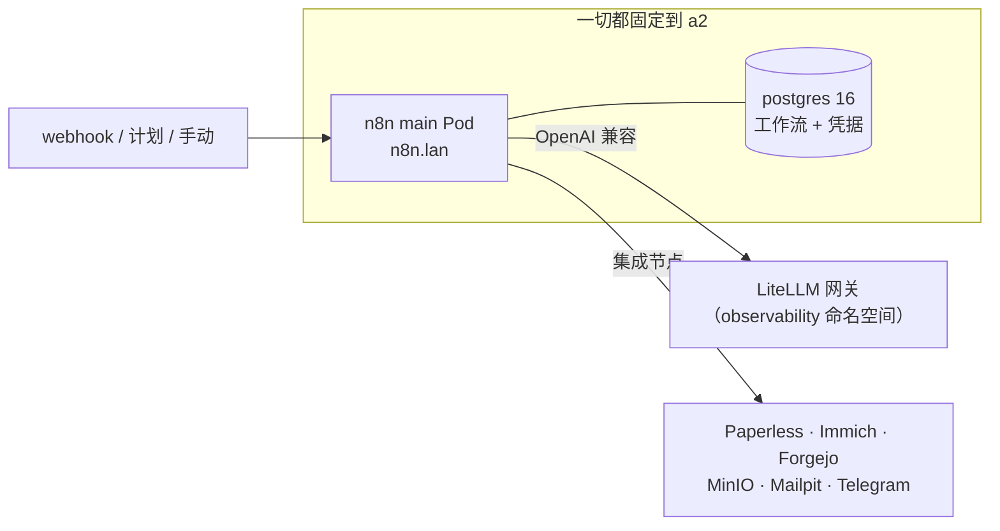

# n8n：事件驱动的黏合层

**先说实在话。** [n8n](https://n8n.io/) 是一个工作流自动化工具——你在画布上把一个个"节点"连起来（一个 webhook 触发，调一个 API，变换 JSON，发到 Telegram），触发条件说了算，它就跑这条流程。可以把它想成 Zapier 或 Make，但是自托管、开放，而且在拖拽拖不动的时候还有一个完整的 **Code 节点**。我把它立在了实验室的 *数据 / 编排* 类别下，就挨着 [Dagster](./dagster.md)，因为它补上了"跑一段逻辑然后做点事"的另一半：Dagster 是我的**定时数据流水线**，n8n 是我的**事件驱动 / webhook / 集成黏合层**。我的这台跑在 a2 上，地址 `https://n8n.lan`。

**我为什么想要它。** Dagster 很适合"每天按计划把这些资产材料化"，但它不是"当*这件事*发生时，就去做*那件事*"该有的形状——一个 webhook 落地、一个文件冒出来、有人戳了一下端点。n8n 恰恰是为这种响应式、重集成的活儿而生的，而且自带两百来个预置的服务节点，于是我不必给每个 API 都手写一个 HTTP 客户端。再配上 [LiteLLM 网关](../ai/litellm.md)，它就成了一个能触达家里*每一个*模型和服务的编排层——Paperless、Immich、Forgejo、MinIO、Mailpit、Telegram 告警机器人——把它们缝到一起，而不用我每次都写一个专门的服务。

这是一台**实验用的实例**，不是加固过的生产编队：单 main、无队列模式、无 Redis。够拿来搭建和学习了；哪天真有工作流配得上，我再加那些扩展的部件。

**看看它长什么样。**

{/* screenshot: data/n8n-canvas-litellm.png — an n8n workflow calling the LiteLLM node */}
{/* screenshot: data/n8n-executions.png — the executions list after a few webhook runs */}

## 它是怎么接线的

服务部分位于 [`clusters/home/n8n/`](https://github.com/briancaffey/home-lab/tree/main/clusters/home/n8n)，由 Argo CD 应用 `home-n8n` 部署。它是 `community-charts/n8n` Helm chart，通过 kustomize 的 `helmCharts:` 展开——和 Dagster **同一套路子**，所以没有需要照看的 helm-CLI release。各个活动部件被刻意保持在最小：

- **单个 main Pod**——`n8n.lan` 上的编辑器 UI、webhook 接收器、任务运行器，全在一个里头。没有单独的 worker/webhook Deployment，因为目前还没有队列模式。
- **它自己的 Postgres。** 一个朴素的 `postgres:16-alpine` Deployment（见 [`database.yaml`](https://github.com/briancaffey/home-lab/tree/main/clusters/home/n8n)），跑在 local-path PVC 上——**不是** chart 自带的 Bitnami 子 chart。和 Dagster 一样的惯例：自带 Postgres，把 chart 的主张挡在外面。
- **一个持久化的 `/home/node/.n8n` 卷**，用来存装好的社区节点、设置和日志。

因为 PVC 是 local-path（固定到节点）而且它和自己的 Postgres 同处一地，**一切都固定到 a2**（通过 `nodeSelector`）。a2 有宽敞的 e-disk，也正是 Dagster 挑中的那个家，理由相同。

## 连接组织：通向每个模型的一扇门

n8n 在这里不只是个玩具，原因是它被直接接到了 [LiteLLM 网关](../ai/litellm.md)上。main Pod 带着一个指向集群内网关的 `LITELLM_BASE_URL`（`http://litellm...:4000/v1`）和一个从带外 secret 取来的 `LITELLM_API_KEY`，我还在 n8n UI 里建了一个对应的 OpenAI 兼容凭据。于是任何工作流都能调 LiteLLM 挡在前面的**任何**模型——我自己 GPU 上的本地 vLLM，或者任务大到家里装不下时的某个云厂商——都经由其他每个消费者都用的那同一扇门。n8n 不需要知道模型；它只知道*一个*网关，而网关知道一切。

这就是把它称作黏合层的整个理由：n8n 对一个事件做出响应，用 LiteLLM 思考，然后作用于 Paperless / Immich / Forgejo / MinIO / Telegram 机器人——这些都是实验室里已经存在的服务。它是 Dagster 按计划做的那件事的、事件驱动的孪生兄弟。

## "想写什么代码都行"的那一面

有两个设置让 n8n 的 Code 节点成了一个真正的沙箱，而不是玩具：`NODE_FUNCTION_ALLOW_BUILTIN` 和 `NODE_FUNCTION_ALLOW_EXTERNAL` 都被完全放开，而且缺失的 npm 包会按需自动安装。这意味着一个 Code 节点可以 `require` 任何内建或外部模块，n8n 会去把它取来——于是可视化节点用尽的时候，我就落到 JavaScript 里，背后是整个 npm 生态。在一台挡在默认拒绝 tailnet 后面的实验实例上，这是个不错的取舍；换成任何暴露得更广的东西，这就是个要好好掂量的旋钮了。

:::warning[🔥 War story]
稳定加密密钥的全部意义，是一课我宁可在纸面上学、也不愿在实践中学的教训。n8n 用 `N8N_ENCRYPTION_KEY` 加密每一份存下来的凭据；**这个密钥一旦变了，每一份保存的凭据就变成无法解密的垃圾**——LiteLLM 凭据、每一个 API token，全部，以一种再怎么恢复 Postgres 数据都救不回来的方式没了。chart 会在安装时乐呵呵地给你*生成*一个全新的密钥，这是个安静的陷阱：重新部署、拿到新密钥、丢掉每一份凭据。所以密钥住在一个带外的 `n8n-encryption-key` secret 里（从不进 git，公开仓库），通过 `existingEncryptionKeySecret` 告诉 chart 用它，Vaultwarden 里还留了一份副本。Postgres 密码和 LiteLLM 密钥享受同样的待遇——都是 GitOps 环被告知别去重新生成的带外 secret。
:::

## 访问与鉴权

`n8n.lan` 拿到一个带 mkcert `n8n-tls` 证书的 Traefik ingress（见 [`ingress.yaml`](https://github.com/briancaffey/home-lab/tree/main/clusters/home/n8n)；`lan-certs.sh` 现在会签发 `n8n.lan`），Homepage 在新的 **Automation** 分组下自动发现它。它也通过 Tailscale operator 远程暴露在 `n8n.<tailnet>.ts.net`。和 Dagster 不同，n8n *确实*有自己的登录（首次启动时的 owner 账户），但真正的边界和实验室里其他一切一样：LAN 或默认拒绝的 tailnet，绝不是开放的公网。

## 工作流的 GitOps（后续工作）

这里有个要老实说的缺口。n8n 的**原生 git 源码管理**——那个把工作流同步到仓库的功能——是**企业版专属**，所以我没法靠它。我*确实*打开的是 **Public API**（带 Swagger），这是通向同一个目标的社区路径：通过它的 REST API 把工作流 JSON 推进推出 n8n，由一个 Forgejo 仓库和 CI 驱动，方式和 [dagster-pipelines](./dagster-projects.md) 搭乘 [CI 环](../gitops/ci-loops.md)一样。这套面向工作流的 GitOps 环**还没建**——现在工作流只住在 Postgres 里——但 API 已经打开，意图也记录在案，好让未来的我知道这条路在哪。在那之前，Vaultwarden 里的加密密钥副本，加上 [Postgres 的每夜备份](../platform/backups.md)，就是我和丢掉我的流之间隔着的东西。
