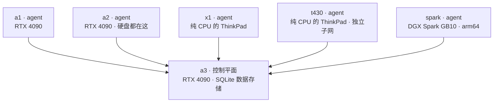

# k3s：集群的基础

**它是什么：**[k3s](https://k3s.io) 是一个轻量级的 Kubernetes 发行版——一个单文件二进制程序，在小型机器上也能良好运行。它是这整个实验室的底层：本站介绍的每一个服务都是一个 k3s 工作负载。

**为什么我使用它：**在这里，Kubernetes 的现实替代方案是一堆 Docker Compose 文件，每个的工作方式、更新方式和出错方式都不同。k3s 给了我一个统一的 API：给语言模型扩容的那套 `kubectl` 命令，同样可以重启我的文档扫描服务。而且不像完整版 Kubernetes，它不需要手动配置证书和 etcd 就能起步——每台机器跑一次安装脚本，集群就运行起来了。

## 当前架构

六台机器，其中一台是控制平面：

主要的限制：**a3 是唯一的控制平面，而且运行在 SQLite 上，而不是 etcd。**如果 a3 宕机，正在运行的 Pod 会继续运行，但在它恢复之前，什么都不能调度、不能变更。这是一个刻意的取舍。在家用硬件加 WiFi 上运行三节点 etcd 控制平面，会带来我目前还不需要的韧性，代价却是每天都要承担的复杂度。目前单控制平面是正确的选择，但迁移到高可用是计划中的下一步。

添加节点很简单：为 server 运行一次 `scripts/install-k3s-server.sh`，再为每个 agent 运行 `scripts/install-k3s-agent.sh`。连另一个子网上的 arm64 DGX Spark 也无需特殊处理就加入了。但要注意，*加入*只是简单的那 10%——token 能让节点变成 `Ready`，可真正让它保持健康的主机准备工作（禁用笔记本睡眠、WiFi 省电、inotify 上限、局域网 CA 信任、镜像仓库固定）是另一回事，而跳过它是无声的。最新的 agent t430 就是几乎什么都没做就 `Ready` 加入的；那段经历见[六台机器](/hardware/nodes)。

## 迁移到高可用的计划

单控制平面是这个实验室里最大的可用性缺口，计划是迁移到高可用的控制平面。k3s 直接支持这一点：它可以用内嵌的 etcd 数据存储替代 SQLite，让多个 server 共享控制平面。标准配置是三个 server，这样 etcd 在丢失一个节点后仍能保持法定人数（quorum）。

目标布局是三个控制平面 server，其余机器作为 agent。三个 server 的现实候选是主局域网上的 amd64 节点——a3、a2 和 a1——因为当前的两个 agent 都不适合运行 etcd：

- **spark** 是 arm64 架构且位于不同子网，所以它保持为 agent。
- **a1** 目前使用不可靠的 USB WiFi，这对 etcd 是个问题。etcd 对网络延迟和丢包很敏感，某个 server 上不稳定的连接可能会扰乱整个 quorum。

最后这一点正是这次迁移**以有线网络为前提**的原因。在消费级 WiFi 上跨三个节点运行 etcd 很脆弱：它的复制流量和延迟要求恰恰是 WiFi 最不擅长的。添加网线（[愿望清单](/hardware/the-rest-of-the-fleet)上排第一的项目）是把高可用做好的前提，所以网线要排在高可用工作之前，而不是之后。

迁移本身也必须谨慎进行，因为它改变了数据存储。计划是先备份集群状态，把 a3 从 SQLite 转换为内嵌 etcd，然后逐个加入另外两个 server，让 quorum 干净地形成。

## 节点标签与调度

每个节点都带着类似 `inference-club.com/box: a2` 的标签，需要在特定机器上运行的工作负载会明确指定：

- GPU 服务钉在它所使用的那块 RTX 4090 所在的节点上。
- 重度使用磁盘的服务钉在 a2，那里有大部分存储。
- 智能体工作负载钉在 x1，那台永远不需要 GPU 的纯 CPU 笔记本。

这是标准的 Kubernetes 调度。家庭实验室的一个实际好处是，`kubectl get nodes` 列出的是你自己命名的机器，而不是匿名的云主机，这让调度更容易理解。

{/* screenshot: foundations/kubectl-get-nodes.png */}

## 日常使用

- `kubectl get nodes` 和 `kubectl -n argocd get applications` —— 快速检查整个集群健康状况的两条命令。
- 对 GPU 模型服务扩容缩容（`kubectl scale --replicas=0` 就是把模型"停车"）。
- 让每个新服务走同一套生命周期：manifest → git → 部署完成。

## 在这里它是怎么配置的

git 之外的东西非常少：安装脚本和节点标签约定在 [`scripts/`](https://github.com/briancaffey/home-lab/tree/main/scripts)，其余一切声明在 [`clusters/home/`](https://github.com/briancaffey/home-lab/tree/main/clusters/home)，由 Argo CD 交付。这个集群本质上就是一个 git 仓库的运行时。
