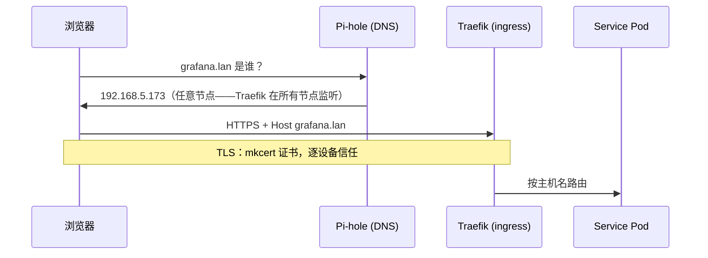

# .lan 网络体系

**它是什么：**这个实验室里的每个服务都有一个好记的 HTTPS 地址——`https://grafana.lan`、`https://jellyfin.lan`、`https://vault.lan`——带着货真价实的绿色小锁，全程在家庭网络内，零云端参与。

**为什么我建议尽早搭建它：**URL 是家庭实验室的用户界面。当服务不再是 `192.168.5.96:30283` 而变成 `immich.lan` 的那一刻，这个实验室就从"基础设施项目"变成了"我的浏览器和家人真正能用的东西"。它也是其他一切的前提：仪表盘互相链接、智能体调用 API、CI 克隆仓库——全都靠名字。

## 一个请求如何找到路

三层结构，每层都简单：

- **DNS** —— Pi-hole 用一条指向集群 ingress 的通配记录回答所有 `*.lan` 查询。（顺便它还负责去广告，对一台 DNS 服务器来说是不错的薪水。）
- **Ingress** —— Traefik（k3s 自带）按主机名把请求路由到正确的服务。
- **TLS** —— 一个我只生成过一次的 [mkcert](https://github.com/FiloSottile/mkcert) 证书颁发机构；每台需要信任实验室的设备安装一次。

那个会让所有人搭进去一整晚的坑：**浏览器拒绝顶级名称正下方的通配证书。**一张 `*.lan` 的证书看起来应该覆盖 `grafana.lan`——Chrome 不同意。所以 [`scripts/lan-certs.sh`](https://github.com/briancaffey/home-lab/tree/main/scripts) *逐一列出*每个主机名，新增服务就要加名字、重新签发。推论：打错的 `.lan` 域名仍然能*解析*（通配 DNS！）但会挂在 TLS 上——一旦你知道该预期什么，这就是正确的失败方式。

集群节点也享受同样待遇，但用的是分域 DNS（split DNS）：只有 `lan` 这个区域会路由到 Pi-hole，所以 Pi-hole 宕机永远不会连带搞垮节点的*常规* DNS。

## 不开端口的远程访问

在外面的时候，少数几个服务可以通过 [Tailscale](https://tailscale.com) 访问——每个暴露的服务都有自己的 tailnet 主机名和真正的 Let's Encrypt 证书。Tailnet 的 ACL 是**默认拒绝**：没有明确授权就什么都连不上，而且只有真正值得远程访问的少数服务才会暴露。任何东西都不对公网开放。

还有一个我一直*刻意不做*的决定：把家里路由器的 DHCP 指向 Pi-hole，让每台家庭设备都自动解析 `.lan`。听起来显然很美，直到你意识到 CA 反正是逐设备信任的——家人的手机能解析域名，然后撞上证书警告。`.lan` 是运维者的网络体系；等到哪天它该服务全家时，正确答案是一个真域名加 Let's Encrypt，而不是给路由器做手术。

## 和它相处的日常

- 每个新服务的成本是两行：证书脚本里加一个主机名，manifest 里加一个 ingress
- `home.lan` 的 Homepage 仪表盘自动发现一切——整个实验室的前门
- 集群内的 Pod 也能解析 `.lan`（CoreDNS 转发该区域），所以 CI 能从 `forgejo.lan` 克隆，智能体能调用 `vault.lan`

{/* screenshot: foundations/homepage-front-door.png */}
