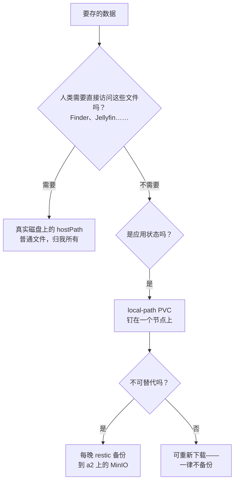

# 存储哲学：刻意的无聊

**它是什么：**这个集群里几乎所有数据，都存在运行它的那台机器的普通本地磁盘上。没有分布式文件系统，没有存储集群，没有魔法。一条信条把一切串起来：**复制是为了可移动性，备份才是为了安全——而没验证过的备份只是一个传闻。**

**为什么我建议从这里起步：**分布式存储是家庭实验室里最诱人的过度工程陷阱。它承诺任何 Pod 都能跑在任何地方，实际交付的是第二份全职工作。本地磁盘加*验证过的每晚备份*就能覆盖真正的风险（丢数据），却不用交运维税——将来你随时可以在真正值得的地方，深思熟虑地引入复制。

## 决策树

**local-path** 是默认的 StorageClass：一个 PVC 就是 Pod 首次落地那个节点上的一个目录，从此这个 Pod 就永远钉在那个节点上。这就是代价——没有可移动性、没有冗余——但它对家庭实验室真正的需求很诚实：数据*存在*，便宜而简单。

**给"人类文件"用 hostPath** 是被低估的一招。种子下载落在 `a2:~/e/downloads`，是归我所有的普通文件——在 Mac 上通过 Samba 像普通文件夹一样浏览，只读挂载进 Jellyfin，任何没听说过 Kubernetes 的工具都能直接用。经验法则：*应用状态用 PVC，人类要碰的文件用普通目录。*把家庭照片库埋进 `/var/lib/rancher/.../pvc-3f9a…` 对谁都没有好处。

**备份是安全层，复制不是。**所有不可替代的东西——密码保险库、Git 托管平台、照片、文档、AI 智能体的记忆——每晚由 [restic](https://restic.net) 备份到 a2 大硬盘上的专用 MinIO，有保留策略、有完整性抽查回读，以及（最关键的）一次**真正执行过的恢复演练**：解密、恢复、打开数据库、数出行数。可重新下载的东西——容器镜像、模型、可以重抓的媒体——*一律*刻意不备份。完整故事在[备份页面](/platform/backups)。

## Longhorn 的试水

家里*确实*有一个做了复制的卷。[Longhorn](https://longhorn.io) 只跑在两个节点上（a2 + a3），把副本放在它们的大机械盘上——绝不占用根分区——这是一次刻意的学习练习，先练手，再考虑托付任何珍贵的东西。

## 和它相处的日常

- 新服务？local-path PVC，两行搞定——钉在哪个节点写在 manifest 里
- 任何开始持有不可替代数据的服务，当天就配上 restic CronJob
- 磁盘健康被持续盯着（[Scrutiny](/observability/scrutiny)——12 块盘，SMART 告警直达手机），因为在节点本地存储的世界里，*一块正在死去的磁盘就是事故本身*
