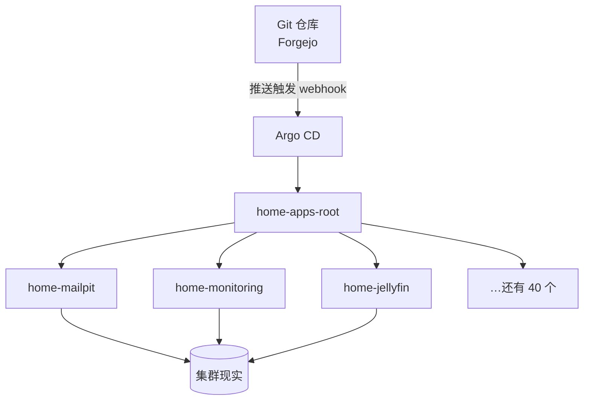

# Argo CD：让集群自己部署自己

## 这是什么

Argo CD 是我几乎再也不用敲 `kubectl apply` 的原因。这套理念叫 **GitOps**——说起来简单，实践起来却相当颠覆：一个 git 仓库保存着"应该运行着什么"的完整描述，集群里的一个控制器持续不断地让现实向这份描述看齐。你不再把变更*推向*集群；你描述你想要的状态，提交它，然后集群自己把自己拉成那个形状。

## 我为什么推荐它

用 Argo CD 之前，部署意味着记住每个服务对应的命令、正确的目录、正确的参数。用了之后，部署意味着**合并一个 pull request**。但真正的杀手级特性是我事先没有料到的：*可见性*。

{/* screenshot: gitops/argocd-tree.png — the Argo CD application tree view */}

## 它是如何接线的

优雅之处在于 **app-of-apps** 模式。一个根 Application（`home-apps-root`）盯着一个目录——[`clusters/home/argocd/apps/`](https://github.com/briancaffey/home-lab/tree/main/clusters/home/argocd/apps)——并根据里面的文件创建其余所有 Application。想把一个服务纳入 GitOps，只需提交一小段 YAML 然后推送。连应用列表本身都是 git 驱动的；根应用管理着它自己。

同步是即时的：每次推送，Forgejo 都会向 Argo 发一个 webhook。没有 webhook 也能工作——Argo 每三分钟轮询一次——但"你还没切换浏览器标签页，合并就已经落进集群"这件事，怎么看都不会腻。

## 信任分级：不是所有应用都一视同仁

每个 Application 有两个旋钮，它们的档位刻画了我对自动化在这个服务上的信任程度：

- **`selfHeal`** —— 如果有人手动改了集群，Argo 要不要改回来？对几乎所有服务都是*开*（git 才是真相）。但对 GitOps 循环自身依赖的那几个服务（Forgejo、Harbor、Vaultwarden、Longhorn）是*关*——Argo 永远不应该擅自重启自己脚下的地基。
- **`prune`** —— 如果一个文件从 git 里删掉了，Argo 要不要删掉对应的对象？只对久经考验的无状态应用*开*。对任何持有数据的东西*永远关闭*。一次糟糕的提交可以让服务降级，但永远不可能删掉你的照片。

日常的样子：

- **每天：** 合并一个 Renovate PR → 看着应用滚动更新 → 收工
- **每周：** `kubectl get applications -n argocd` → 44 行绿色 → 合上笔记本
- **事故时：** 一行红色*就是*警报，而且通常比其他任何机制都先发现

## 它住在哪里

安装与配置：[`clusters/home/argocd/`](https://github.com/briancaffey/home-lab/tree/main/clusters/home/argocd)。最刁钻的配置细节：Argo 配置里的 `kustomize.buildOptions: --enable-helm`，它让 Argo 能渲染那些内嵌 Helm chart 的目录——没有它，实验室三分之一的服务都构建不出来。
