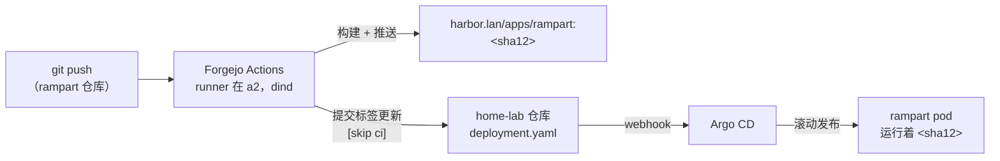

# CI：推送即上线，全程不沾手

## 这是什么

对于那些*代码*归我所有的应用（而不只是配置），实验室跑着一条完整的、全自托管的持续集成流水线：把代码推到我的 Forgejo，Actions runner 构建容器镜像，镜像落进 Harbor，然后一个机器人提交更新部署 manifest——Argo CD 随即完成滚动发布。从 `git push` 到新 pod 开始接流量，没有任何人碰任何东西。

**Rampart**——我的 PII 脱敏服务——是参考实现。它从"代码蜗居在某个子目录里、靠我的笔记本手工构建"到"独立仓库配完整流水线"的历程，是未来每个应用照抄的模板。

## 我为什么推荐搭这一套

两个原因。第一个显而易见：手工构建镜像（`docker build`、`docker save`、`crane push`、改 manifest、apply……）是五个容易出错的步骤，现在归零。第二个更微妙：**每一个部署中的镜像都能追溯到一个 commit SHA**。镜像标签*就是* git SHA。出问题时，"现在到底跑的是什么？"有一个单词的答案，而"改了什么？"就是一条 `git diff`。

## 完整的循环

巧妙的是最后一程：CI 任务的最后一步克隆*基础设施*仓库，重写 rampart 部署 manifest 里的一个镜像标签，然后带着 `[skip ci]` 提交。这个提交触发 webhook；部署由 Argo 完成。构建系统从头到尾不和集群说一句话——它只和 git 对话，而这正是全部意义所在。

runner 本身（[`clusters/home/forgejo/runner/`](https://github.com/briancaffey/home-lab/tree/main/clusters/home/forgejo/runner)）是跑在我最壮实节点上的 Docker-in-Docker，构建层缓存放在持久卷上，所以重复构建很快。

## 新应用入伙需要什么

配方刻意保持简短——rampart 的仓库就是模板：

- Forgejo 上的一个仓库，带 `Dockerfile` 和一个约 40 行的 Actions workflow
- 两个 secret：一个只有推送权限的 Harbor 机器人令牌，一个用于更新 manifest 的 git 令牌
- home-lab 仓库里一份供 Argo 盯着的部署 manifest

- **日常现实：** 改代码 → 推送 → 两分钟后新版本已在服务
- **审计现实：** `kubectl get deploy rampart -o yaml | grep image:` → 一个 SHA → `git show` 那个 SHA
- **Renovate 加成：** 机器人也盯着应用仓库，所以连*依赖*升级都原封不动地流过同一条构建-部署循环
