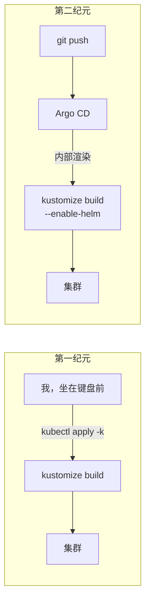

# Kustomize 的角色是如何变迁的

## 这个页面是什么

这里的大多数页面描述的是某个服务。这一页描述的是一场*演化*——同一个工具，如何从"我部署一切的方式"变成"没人再想起的渲染细节"。如果你今天正在搭建自己的 homelab，这段弧线你大概率也会亲身走一遍，所以这里先把地图画好。

## 第一纪元：`kubectl apply -k` 就是部署动词

最开始，每个服务就是一个目录——`clusters/home/<name>/`，里面有一个列出所有 manifest 的 `kustomization.yaml`——部署就是敲下：

```bash
kubectl apply -k clusters/home/jellyfin
```

这已经比裸写 YAML 强多了：kustomize 给了我"目录即部署单元"、把配置文件变成 ConfigMap 的 `configMapGenerator`，以及命名空间标注。仓库在*精神上*是事实来源——但唯一的执法者是我的自律。没有任何东西阻止集群漂移；忘了 apply 也没有任何东西报警；而且每次部署都是我本人，坐在键盘前，靠记忆行事。

## 尴尬的中期：Helm 膨胀

有些软件只以 Helm chart 的形式发布。Kustomize 可以就地展开 chart（kustomization 里的 `helmCharts:`），这保住了"一个服务一个目录"的模型——但也买回来一堆锋利的毛边：

- `kubectl kustomize --enable-helm` 在 Helm v4 面前直接罢工，于是部署得用*独立的* kustomize 二进制——第二个工具，行为还不一样。
- 有些服务干脆是完整的 Helm release，得用 `helm upgrade` 部署，而且**绝对不能**用 kubectl apply……

## 第二纪元：kustomize 沦为渲染细节

然后 Argo CD 来了。有意思的是*没有*改变的东西：仓库结构。目录即单元、`configMapGenerator`、同样的 kustomization——全都还在（[`clusters/home/`](https://github.com/briancaffey/home-lab/tree/main/clusters/home)）。改变的是**谁来执行构建**：



Argo 的 repo-server 自己渲染每一个目录（一行配置 `kustomize.buildOptions: --enable-helm` 就解锁了那些内嵌 chart 的目录）。独立二进制的杂耍：消失了。错误命名空间的地雷：*结构上不可能了*，因为 Argo 每次 apply 都带着明确的目标命名空间。那些 helm-CLI 管理的 release：一个接一个迁移，直到 `helm list` 在任何地方都返回空——集群里零个 Helm 托管的 release；Helm 如今只是 Argo 调用的一个模板引擎。

## 什么留下了，什么消亡了

**留下的：** 目录即部署单元 · `configMapGenerator`（配合稳定命名） · kustomize 作为渲染层 · "一个服务一个文件夹"的心智模型。

**消亡的：** 手动 apply · 独立二进制的要求 · "这个目录归哪个工具部署？"的问题 · 地雷清单 · 作为部署工具的 Helm。

工具活了下来；围绕它的*仪式*没有。这是最健康的一种演化——说实话，也是整场 GitOps 迁移的微缩课程：保留承载意义的结构，删除只承载风险的结构。
