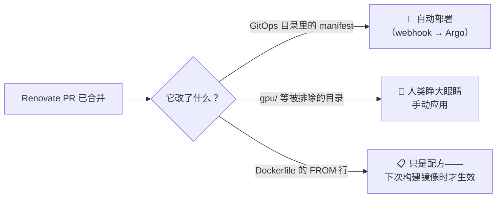

# Renovate：只提议、不拍板的机器人

## 这是什么

Renovate 是一个机器人：它读取我仓库里每一个钉死的版本号——容器镜像标签、Helm chart 版本、甚至埋在某个 initContainer 下载 URL 里的 Bitwarden CLI 版本——去上游检查有没有新版本，然后为每一个更新开一个 pull request。它作为一个普通的 Kubernetes CronJob 每天早上 6 点运行。它从不部署任何东西；它只*提议*。合并的人始终是我。

## 我为什么推荐它

用 Renovate 之前，"所有东西都是最新的吗？"这个问题，不花一下午在各个镜像仓库之间切标签页就无法回答。现在它是一个页面：**依赖仪表盘（Dependency Dashboard）**——机器人在我的 Forgejo 里维护的一个 issue，列出它追踪的每个依赖、每个待处理的更新、每个打开的 PR。"我落后了吗？"的答案永远是最新的、永远在同一个地方——而且答案精确得让人愉快。

第一次运行的结果相当谦卑：它发现 Grafana 被钉在落后十二个小版本的位置，Prometheus 落后得更远。这就是每一个纯手工维护的 homelab 的真实基线。

{/* screenshot: gitops/dependency-dashboard.png — the Dependency Dashboard issue */}

## PR 的三种口味

不是每个 Renovate PR 的含义都相同，早点搞明白这一点能省去很多困惑：

1. **自动部署型** —— 大多数 PR。目录由 Argo CD 盯着，所以合并*就是*部署。
2. **合并后人工应用型** —— GPU 底层组件之类的集群关键目录被有意排除在 Argo 管辖之外；合并只更新 git，由人类睁大眼睛手动应用。
3. **纯配方型** —— Dockerfile 里 `FROM node:24-slim` 的升级只改变*构建配方*；在下一次镜像构建把它变成现实之前，什么都不会发生。

## 仪式闸门

有些更新永远不应该装成日常更新的样子出现。三类软件包被挡在明确的"仪表盘勾选审批"之后，每条规则都来自一次真实事件：

- **`storage-ceremony`**（Longhorn）：存储升级有序且单向——先读发布说明、先确认卷健康。
- **`gpu-ceremony`**（NVIDIA 底层组件）：一次看似无害的 device-plugin 升级曾在版本差异里藏了*两个*破坏性的 manifest 变更，碰到的第一个节点就开始崩溃循环。
- **`db-ceremony`**（数据库大版本）：一个 Postgres 14→16 的 PR 像日常更新一样被合并，几分钟内数据库倒地——Postgres 的数据目录无法跨大版本。

## 值得知道的细节

- **限流：** 每小时 5 个 PR，所以一个落后已久的仓库会以涓涓细流的方式排空，而不是洪水。仪表盘列出排队中的更新；勾一个复选框就能提前召唤任何一个。
- **它会更新自己：** Renovate 自己的镜像标签也在仓库里，于是某天早上它开了一个升级 Renovate 的 PR。合并之后，升级过的机器人转身去给其他所有东西找升级。循环完全闭合。
- **它住在哪里：** [`clusters/home/renovate/`](https://github.com/briancaffey/home-lab/tree/main/clusters/home/renovate)（CronJob）和 [`renovate.json`](https://github.com/briancaffey/home-lab/blob/main/renovate.json)（策略——分组、闸门、忽略规则）。
