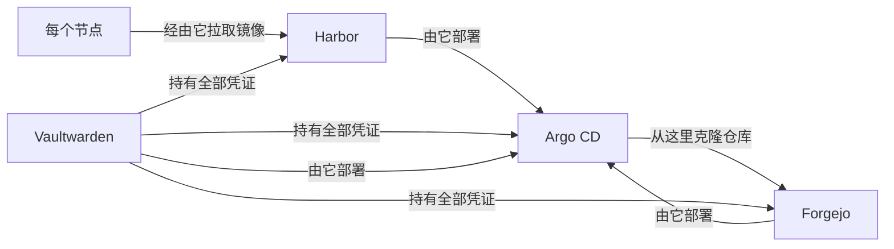

# 循环依赖三兄弟

## 这是什么

有三个服务——**Forgejo**（我的 git 服务器）、**Harbor**（我的容器镜像仓库）和 **Vaultwarden**（我的密码库）——与集群里的其他一切都不同：它们是 GitOps 循环自身赖以站立的地基。Argo CD *从 Forgejo* 读取期望状态。节点*通过 Harbor* 拉取镜像。运维任何东西所用的每一份凭证都*从 Vaultwarden* 引导而来。

用它们所支撑的机器去管理它们自己，会形成"系统管理自己地基"的循环。这是自托管世界里的"给自己的双手做手术"。

## 为什么重要

对其他任何服务来说，"一次糟糕的提交搞坏了它"有一个无聊的解法：*用* GitOps 系统去修它。但对这三兄弟来说，一次糟糕的提交可能搞坏你用来修它的那个系统——修理说明书锁在坏掉的东西肚子里。其中 Forgejo 的循环最锋利：

## 设计：刻意削弱的自动化

三兄弟运行着整个舰队里最保守的同步策略：

- **提交仍然会部署**（自动同步）——工作流保持 git 优先。
- **`selfHeal: false`** —— Argo 永远不*擅自*重启地基。漂移会显示为"OutOfSync"，交给人类判断，而不是触发一次对"Argo 读取真相之处"的重启。
- **`prune: false`，永远。**

Harbor 还需要一次额外的小手术：它的 Helm chart *每次渲染*都会重新生成四个内部密钥，这会让 Argo 永远处于 out-of-sync 状态，而且每次同步都会轮换 Harbor 的信任令牌。解法——通过把 chart 渲染两遍再做 diff 的实证方法找到的——是一组精确的 `ignoreDifferences` 规则，告诉 Argo 哪些字段永远别碰。最终的接管什么都没改变：整个过程中，每个 Harbor pod 的运行时长都原封未动。

## 真正的安全网：仓库存在于三个地方

对"Forgejo 挂了怎么办？"最深层的回答不是什么精妙的 Kubernetes 技巧——而是事实来源本身的冗余：

- **Forgejo** —— 主库；Argo 盯着的那个
- **GitHub** —— 自动推送镜像；每次合并几秒内同步过去
- **我的笔记本** —— 永远有一份完整克隆

外加一个永远不变的事实：无论如何，`kubectl apply -k` 都能用。GitOps 是集群*偏好*的运维方式，不是唯一的门。完整流程写在破窗手册 [`docs/18-gitops-break-glass.md`](https://github.com/briancaffey/home-lab/blob/main/docs/18-gitops-break-glass.md) 里，三兄弟的 Application 定义在 [`clusters/home/argocd/apps/home-services.yaml`](https://github.com/briancaffey/home-lab/blob/main/clusters/home/argocd/apps/home-services.yaml)。

- **日常现实：** 三兄弟表现得和其他应用没两样——合并、部署、绿色
- **区别在于：** 它们失败得*更安全*，因为自动化在这里从未被允许自作主张
- **教训：** 自托管自己的地基没问题——前提是在需要之前，就把"如何站到循环之外"写下来
