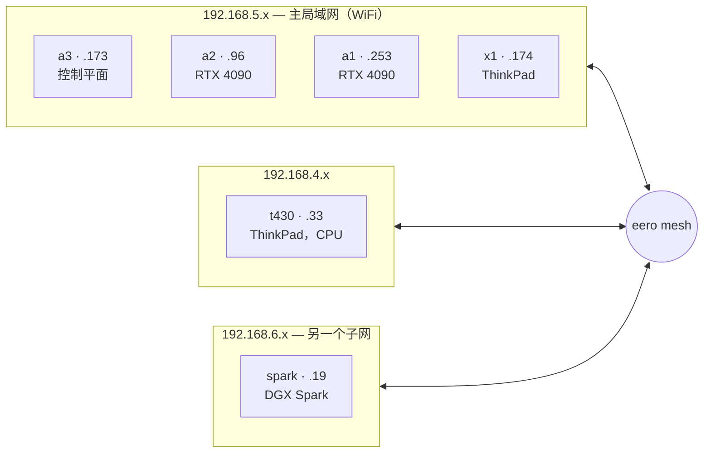

# 六台机器

集群是先围绕 GPU 建起来的。主要目标是在家里运行 AI 推理，所以机器是按这个需求选的，其他服务——媒体、照片、文档、Git——是后来才加进来的，因为硬件已经在运行了。

它由六台不同的电脑组成，全部连着家用 WiFi，运行 k3s。它们并不相同，实验室里有几个设计决策就是为了绕开某台特定机器的具体限制。

| 节点 | 角色 | CPU 架构 | GPU | 说明 |
|------|------|----------|-----|------|
| **a3** | 控制平面 + 工作节点 | amd64 | RTX 4090 | 运行唯一的 k3s server |
| **a2** | 工作节点 | amd64 | RTX 4090 | 最忙的节点；磁盘最多 |
| **a1** | 工作节点 | amd64 | RTX 4090 | 语音模型；空闲 GPU 最多 |
| **x1** | 工作节点 | amd64 | 无 | 纯 CPU 笔记本 |
| **t430** | 工作节点 | amd64 | 无 | 纯 CPU 的 ThinkPad；独立子网 |
| **spark** | 工作节点 | arm64 | GB10（128 GB 统一内存） | arm64；经常离线 |

## a3 —— 控制平面

a3 运行着唯一的 k3s server，所以它一旦宕机，集群的 API 也随之停止。该 server 使用 SQLite 而非高可用方案，这是一个已知且被接受的风险。a3 还配有一块 RTX 4090、一块 2.6 TB 的数据盘，并承载着最需要稳定的服务：密码保险库、Prometheus 和平台的对象存储。

## a2 —— 最忙的节点

a2 运行的服务最多，远超其他节点：全家的 DNS（Pi-hole）、Git 托管平台、容器镜像仓库、CI 运行器、所有媒体服务，以及备份目标。它能承担这些，是因为它的磁盘最多——两块 2 TB NVMe，加上 6 TB 和 4 TB 的机械盘，还有一块几乎空着的 5.5 TB 盘，用作下载、备份和存储副本的着陆区。新服务通常都放在这里。

## a1 —— 语音模型

第三台配备 RTX 4090 的机器。它承载语音相关的模型服务：按需加载和卸载的文本转语音（TTS）和语音增强模型。由于它常驻的服务比 a2 或 a3 少，因此在需要 GPU 时它的空闲容量最多。

## x1 —— 笔记本节点

一台 ThinkPad X1 Carbon，纯 CPU，加入集群用来承载 [Hermes](/ai/hermes)——集群内的 AI 智能体——以及浏览器版代码编辑器。笔记本很适合当智能体宿主：它安静、低功耗，电池相当于自带的 UPS。有一个需要注意的地方是，电池也会掩盖供电问题：如果电源线松了，机器会靠电池继续运行，直到电量耗尽才关机。为此它现在设置了电池告警。

## t430 —— 第二台笔记本节点

一台老旧的 ThinkPad T430：四核、8 GB 内存、约 108 GB 的 SATA SSD，没有 GPU。它是编队里最弱的机器，远弱于其他——而这正是重点：它来这儿是为了吸收一些小型的纯 CPU 服务，把 4090 机器腾出来干 GPU 的活。和 x1 一样，它被刻意排除在 Longhorn 存储成员之外，也不承担任何 GPU 角色：一台孱弱、仅靠 WiFi 的笔记本不适合承载复制存储或模型权重。它还位于自己的子网上（192.168.4.x），因此顺便验证了一件事：节点不必和主局域网同网段也能加入。

而给它做上线（onboarding）时，有意思的部分才开始。

:::warning[🔥 War story]
t430 在 `kubectl get nodes` 里显示为 `Ready`，我差点就打了勾、翻篇了。但*加入*集群和*为集群做好准备*是两码事。加入只需要一个 token；而真正让一台笔记本节点保持健康的东西全都是另外的主机准备工作——屏蔽睡眠和挂起、告诉它忽略合盖、关闭 WiFi 省电（就是这一项防止笔记本节点抖动成 `NotReady`）、调高 inotify 上限好让监视文件的 Pod 不至于 crashloop、信任局域网证书颁发机构（CA），以及固定 `harbor.lan`。在 t430 上，这些全都被悄悄跳过了。它是靠运气 `Ready`，不是靠真的就绪。我反复重新学到的教训：绿色的节点状态只告诉你 kubelet 在和 API 通话——它对准备工作是否做过只字不提。去核实准备工作，别信状态。
:::

## spark —— arm64 节点

一台 NVIDIA DGX Spark：arm64 架构、GB10 芯片，以及 **128 GB 由 GPU 和 CPU 共享的统一内存**，这让它装得下 4090 装不下的模型。它与其他节点有几处不同：不同的 CPU 架构（镜像必须是多架构的才能在它上面运行）、不同的子网，以及经常离线。集群把它当作专用节点，不在它上面运行任何关键服务。

## 全部运行在 WiFi 上

这个集群里没有一台机器插着网线。存储复制、CI 镜像推送和多 GB 的模型下载全部通过消费级 WiFi 运行。它的表现好于预期，而添加有线网络是[愿望清单](/hardware/the-rest-of-the-fleet)上价值最高的升级。
