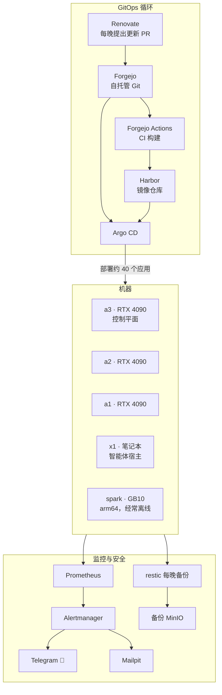

# 实验室速览

这个网站记录了我的家庭实验室：**家里的六台电脑，在 Kubernetes 上运行着大约四十个自托管服务**，包括配备 GPU 的 AI 模型、照片库、媒体服务器、密码保险库、Git 服务器，以及让这一切保持更新、备份和监控的工具。

我搭建它是为了通过实际运行来学习基础设施的工作原理——一个我们全家都依赖的真实系统，因为我们的 DNS、照片和文档都存放在这里。这个项目的一部分是把 AI 智能体作为运维者来使用：它们有自己的凭证、访问密码保险库的权限，以及修改集群的能力。

这里的一切都由一个公开的 Git 仓库驱动。每个服务都有一个目录，每次变更都是一次提交。机器人提出更新，我合并它们，集群随之应用这些变更。

## 仪表盘

实验室的入口是一个自托管的 Homepage 仪表盘，它在一个屏幕上列出所有正在运行的服务，按领域分组，并显示实时状态和各机器的资源使用情况。

## 一页看懂整个系统

四台 GPU 机器加一台改用的笔记本，全部运行在家用 WiFi 上（见[硬件篇](/hardware/nodes)）。一个 Git 仓库驱动一个部署循环，其余部分由告警系统监控。

## 这里实际在运行什么

- **AI 与推理** —— vLLM 模型服务器、图像/视频/语音生成、位于前端的 [LiteLLM 网关](/ai/litellm)、[PII 脱敏守卫](/ai/rampart)，以及 [Hermes](/ai/hermes)——一个运行在集群内、拥有自己保险库权限的智能体。
- **平台与 GitOps** —— [Argo CD](/gitops/argocd)、[Renovate](/gitops/renovate)，以及其余部分所依赖的基础：Forgejo、Harbor 和 Vaultwarden 组成的[自托管三件套](/gitops/the-trio)。
- **数据与编排** —— [Dagster](/data/dagster) 跑定时流水线，读我自己的 Prometheus、用我自己的 LLM 网关写报告；[n8n](/data/n8n) 跑事件驱动的 webhook / 集成工作流。它俩合起来，是覆盖在其他一切之上的可编程黏合层。
- **家庭服务** —— [Jellyfin](/media/jellyfin)、[Immich](/media/immich)、[Paperless](/media/paperless)、音乐、有声书，以及一条为家人整理下载文件的[下载流水线](/media/downloads)。
- **监控** —— [Prometheus 与 Grafana](/observability/prometheus-grafana)、[发送到手机的告警](/observability/alerting)、[磁盘健康监控](/observability/scrutiny)，以及[每晚执行、经过恢复测试的备份](/platform/backups)。

## 集群的 3D 视图

这个实验室有一个 **3D 探索器**。[clusterscape](https://briancaffey.github.io/clusterscape/) 以可视化方式渲染集群：机器、Pod，以及连接它们的服务。它读取真实集群的脱敏快照，可以帮助你了解各个部分如何组合在一起。

{/* screenshot: index/clusterscape-hero.png — hero shot, Brian wants to compose this one personally */}

## 从哪里开始

- **刚接触 Kubernetes** → 先看[六台机器](/hardware/nodes)，再看 [k3s](/foundations/k3s)——从硬件讲起。
- **对工程感兴趣** → [连接组织](/tissue/trust-fabric)——一个凭证保险库、一个 Git 仓库和一架委托阶梯如何把四十个服务组合成一个系统。
- **关注 GitOps** → [Argo CD](/gitops/argocd) 和 [CI 循环](/gitops/ci-loops)——合并一个 Pull Request，集群随之更新。
- **AI 智能体** → 从 `/llms.txt` 开始。每个页面的 frontmatter 都包含指向真实配置的 `repo_path` 指针。
