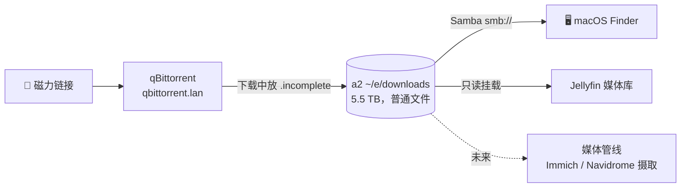

# 下载：文件到底住在哪儿

**它是什么：** 媒体管线的"进货"端——带 Web 界面的 **qBittorrent**，把文件写进 a2 上一个巨大的普通目录，再通过 **Samba** 暴露给我的 Mac、通过 **Jellyfin** 暴露给电视。粘贴一个磁力链接；文件就出现在所有该出现的地方。

**这一页为什么存在：** 搭这套东西的时候，我问了每个 Kubernetes 新手迟早都会问的问题：*"好，但文件到底去哪儿了？我怎么在我的普通电脑上看到它们，就像……'文稿'文件夹那样？"* 这个问题的答案后来成了一条值得写下来的家规。

**看看它长什么样：**

{/* screenshot: media/qbittorrent-ui.png — web UI with a completed torrent, paused at ratio 0 */}
{/* screenshot: media/finder-smb.png — the downloads share mounted in macOS Finder */}

## 家规：应用状态放 PVC，给人用的文件放普通目录

普通的 Kubernetes 卷会把数据埋进 `/var/lib/rancher/k3s/storage/pvc-<uuid>/…`——技术上存在，实际上隐形。这对*应用状态*（数据库、配置）来说是正确的归宿，对*人想要触碰的文件*来说则恰恰是错误的。

所以 qBittorrent 的配置放在 PVC 上，而它的**下载内容落在 hostPath 上**：a2 那块几乎空着的 5.5 TB 硬盘上的一个普通目录，属主就是我自己的用户。`ssh a2 ls ~/e/downloads`——它们就是普通文件。其余一切都从这一个决定顺理成章地展开。

## 我平时用它做什么

- 在 `https://qbittorrent.lan` 粘贴磁力/种子链接 → 完事
- 文件像普通文件夹一样出现在 Mac 的 **Finder** 里（`smb://192.168.5.96`，凭据在保险库里）——拖拽、重命名、直接打开
- 下载完的视频自动出现在 **Jellyfin** 的媒体库里（只读挂载）
- Linux ISO 和数据集落在一块有几 TB 余量的硬盘上，而不是我的笔记本里

## 配置里有意思的部分

全部在 [`clusters/home/qbittorrent/`](https://github.com/briancaffey/home-lab/tree/main/clusters/home/qbittorrent)：

- **只下不传（leech）模式是靠配置而非自觉来执行的**：分享率 `0`、做种时间 `0`、完成即暂停。下载一到 100%，立刻停止。这是一台下载家电，不是做种机——而且这条规则写在配置里，重启后依然生效。
- **下载中的文件放在 `.incomplete` 点目录里**——Jellyfin 的扫描器永远看不到残缺文件，媒体库里出现的东西保证都能播放。
- BitTorrent 的对等端口是一个固定的 NodePort——没有入站通路的话，下载速度会不声不响地变差（Kubernetes 里可没有 UPnP 仙女）。
- 容器以我自己的 uid 写文件，所以共享目录上的属主就是……我。不需要考古式的 chown。

## 完整流程

