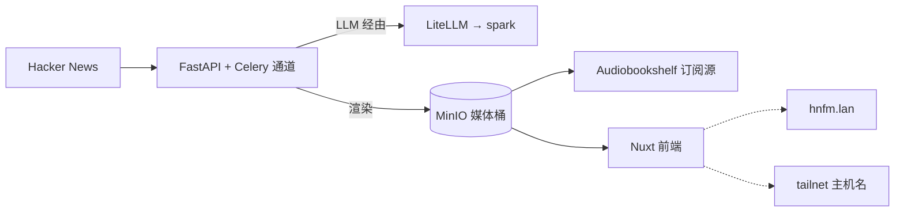

# hn.fm

**它是什么：**一个我自己写的应用：读取 Hacker News，挑出值得一听的故事，用 LLM 写脚本、配音，渲染成短视频和一条播客订阅源——全部在集群内完成。它由 FastAPI 后端、Celery 工作通道、Nuxt 前端和一个渲染 sidecar 组成，自带 Postgres、Redis 和 MinIO，跑在 **a2** 上，因为磁盘在那里。

**为什么我建议你也做一个这样的东西：**本章节的其他每一页都在讲运行*别人的*软件。hn.fm 是实验室唯一一处端到端运行*我自己的*软件的地方——我的仓库、我的 CI、我的 chart、我的 GitOps 循环——也正是在这里，基础设施不再是爱好，而开始成为平台。如果你已经把机器（Forgejo、Harbor、Argo CD、LiteLLM）搭起来了，一个自己的应用就是它们真正可用的证明。

## 它是怎么部署的

hn.fm 是一个 Argo CD **多源（multi-source）** Application，这种拆分是有意为之：

- Helm chart *跟着应用走*，放在 [hn.fm 仓库](https://github.com/briancaffey/hn.fm)里（`charts/hnfm/`）。应用知道自己该长什么样。
- 环境 values *放在这里*，即 [`clusters/home/hnfm/values.yaml`](https://github.com/briancaffey/home-lab/tree/main/clusters/home/hnfm)。集群知道用哪个节点、开哪些功能、走哪个网关。
- 应用仓库的 CI 构建镜像，推到 `harbor.lan/apps/`，然后把新的镜像 tag 提交进那个 values 文件。**那次提交就是发布**——Argo 察觉、同步、完事。

密钥通过 External Secrets 从 Vaultwarden 条目里取得；两个仓库里都没有任何敏感内容。LLM 调用走集群内的 [LiteLLM 网关](../ai/litellm.md)，固定到 spark 上的本地模型且*没有*任何回退——我可不想一份 Hacker News 摘要悄悄向云厂商计费。

## 两扇前门

在局域网内它是 `https://hnfm.lan`，由 Traefik 按路径路由：`/api`、`/docs` 等去 FastAPI 服务，`/hnfm-media` 去 MinIO，`/flower` 去 Celery 仪表盘，其余一切去 Nuxt 前端。Homepage 会在"Apps"分组下自动发现它。

在外面时，同一套部署通过 Tailscale operator 在 `https://hnfm.<tailnet>.ts.net` 应答——这是 [`clusters/home/tailscale/`](https://github.com/briancaffey/home-lab/tree/main/clusters/home/tailscale) 里的第二个 Ingress，逐条镜像 chart 的路径表。如果 chart 的 ingress 哪天多了一条路径，这个文件也必须跟着加；文件顶部的注释就是这么写的，因为我一定会忘。Homepage 把它列在静态的"Tailnet"分组里。

hn.fm 自己没有登录。在局域网内这没问题；在 tailnet 上，默认拒绝的 ACL *就是*大门，与这里其他所有远程暴露的服务姿态一致。任何东西都不对公网开放。

:::warning[🔥 War story]
加那个 Tailscale Ingress 花了两分钟，得到的是一个能加载、然后什么都不干的页面。这个应用在三个不同的地方被钉死在了单一源（origin）上。Nuxt 前端用一个*绝对*的 `NUXT_PUBLIC_API_BASE`——`https://hnfm.lan`——调用 API，于是用 tailnet 域名打开的浏览器会去找局域网域名，然后失败。CORS 只允许那一个源。媒体 URL 是 MinIO 的预签名链接，而预签名是针对特定 `Host` 的——为 `hnfm.lan` 签的 URL 通过 tailnet 域名去取，返回 `SignatureDoesNotMatch`。三个症状，一种病：**应用假定自己只有一个主机名。**修复落在 hn.fm 仓库里，而不是集群里：API base 现在为空，浏览器在提供页面的那个主机上调用 `/api`（同源，CORS 于是不再是问题）；服务端渲染没法用相对 URL，所以一个小小的 Nitro 通配路由把 `/api` 转发到集群内的 web Service；媒体端点则为请求*到达时*所用的源签发预签名 URL（`X-Forwarded-Host`，回退到 `Host`）。我会带到以后每一个服务上的教训：环境变量里的绝对公网 URL、单一源的 CORS、绑定主机的签名 URL，就是破坏多域名暴露的三样东西。优先使用相对 URL，并从请求中推导主机名。
:::

## 和它相处的日常

- 新视频按计划落地（每六小时一个），摘要发到 Kindle，音频订阅源像任何其他播客一样出现在 [Audiobookshelf](./music-and-books.md) 里
- 渲染变慢时用 `https://hnfm.lan/flower` 看 Celery 通道
- 往 hn.fm 仓库推送就是全部的部署流程——从第一天之后我就没再为它敲过 `kubectl apply`

{/* screenshot: media/hnfm-frontend.png — hn.fm 的故事网格，带已渲染的视频 */}
