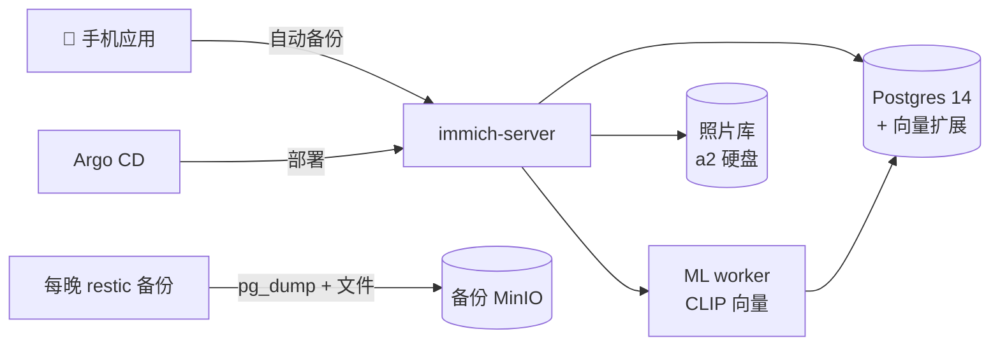

# Immich：照片留在家里

**它是什么：** Immich 是一个自托管的照片和视频平台——手机自动备份、时间线、相册、分享链接、人脸识别，还有它的绝活：**语义搜索**。输入"海滩上的狗"，它就能找到你家的狗在海滩上的照片——靠的是它自带的机器学习服务计算出的 CLIP 向量。

**为什么我推荐它：** 照片是整个实验室里唯一真正不可替代的数据。凭据可以轮换，媒体可以重新下载，配置都在 git 里，但照片无法重拍。Immich 提供了一个自托管的 Google Photos 替代方案，相册档案始终在我自己的掌控之中。它也是一个迭代很快的项目，因此更新时需要谨慎。

**看看它长什么样：**

{/* screenshot: media/immich-timeline.png — photo timeline */}
{/* screenshot: media/immich-search.png — semantic search results for a natural-language query */}

## 我平时用它做什么

- 手机一连上家里 WiFi，照片就自动备份
- "找一下三月份拍的那张白板照片"——语义搜索真的能找到
- 按人脸自动分组相册，而人脸数据从不上传到任何云端
- 在局域网里直接分享相册链接，而不是用聊天软件发压缩过的副本

## 配置里有意思的部分

Immich 其实是*四个*服务披着一件风衣——server、机器学习 worker、Redis，以及它专属的 Postgres——全部位于 a2 上的 [`clusters/home/immich/`](https://github.com/briancaffey/home-lab/tree/main/clusters/home/immich)。这个 Postgres 很特别：它跑的是 Immich 官方镜像，内置了**向量扩展**（VectorChord/pgvecto.rs），因为语义搜索就活在数据库里。

正因为它特别，才值得被郑重对待：

- **每晚的备份做得规规矩矩**：照片库做文件级复制，数据库用 `pg_dump` 导出——而且是用*和 server 完全相同的镜像版本*来运行 pg_dump，让导出工具和服务器永远不会出现版本偏差。
- ML 模型缓存被刻意*排除*在备份之外——它可以重新下载。本实验室的家规：凡是互联网能恢复的东西，绝不备份。

## 它在整个体系中的位置

