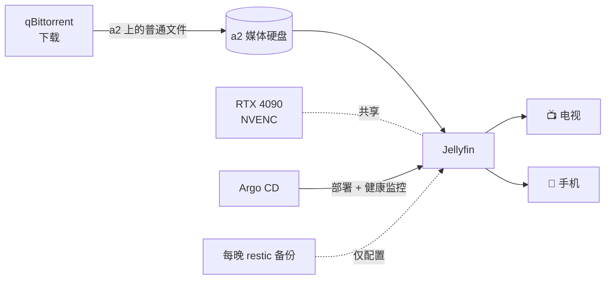

# Jellyfin：媒体服务器

**它是什么：** Jellyfin 是一个免费开源的媒体服务器——可以理解为没有账号系统、没有遥测、也不会催你订阅的 Plex。它扫描存放视频和音频的文件夹，抓取封面和元数据，然后串流到家里的任何浏览器、手机或电视应用上。

**为什么我推荐它：** 正是这个组件把"硬盘上的文件"变成了"客厅里的观影体验"，而且它对你毫无索取。不需要云账号，没有月费，观看记录只留在你自己家里。而且因为我的 Jellyfin 就跑在一块 GPU 旁边，它可以毫不费力地把任何格式转码成任何格式。

**看看它长什么样：**

{/* screenshot: media/jellyfin-library.png — library grid view */}
{/* screenshot: media/jellyfin-playback.png — playback with transcode badge */}

## 我平时用它做什么

- 在局域网里把媒体库串流到电视和手机（`https://jellyfin.lan`）
- 直接观看存在 a2 硬盘上的屏幕录像和采集素材
- 播放 qBittorrent 刚下载完的东西——新文件会自动出现在媒体库里，完全不需要人工整理（参见[下载](/media/downloads)）
- 收听实验室其他服务生成的 "Hacker News FM" 播客音频库

## 配置里有意思的部分

Jellyfin 部署在 **a2** 上，这并非偶然——a2 既有媒体硬盘，*又*有一块 RTX 4090。Deployment 设置了 `runtimeClassName: nvidia` 并以共享模式使用 GPU，于是这块白天跑 AI 模型的显卡，晚上就干起了 **NVENC 硬件转码**的活。一部 4K 原盘重封装可以变成适合手机观看的流，CPU 几乎毫无感觉。清单文件在 [`clusters/home/jellyfin/`](https://github.com/briancaffey/home-lab/tree/main/clusters/home/jellyfin)。

下载目录以**只读**方式挂载进容器，正在下载中的种子被放在一个 Jellyfin 扫描器会忽略的点目录里——所以媒体库里永远只会出现已完成的文件。

## 它在整个体系中的位置

媒体文件本身不做备份——它们是可以重新获取的。而*配置*（观看进度、媒体库设置）则和其他所有东西一样，搭上每晚的备份列车。
