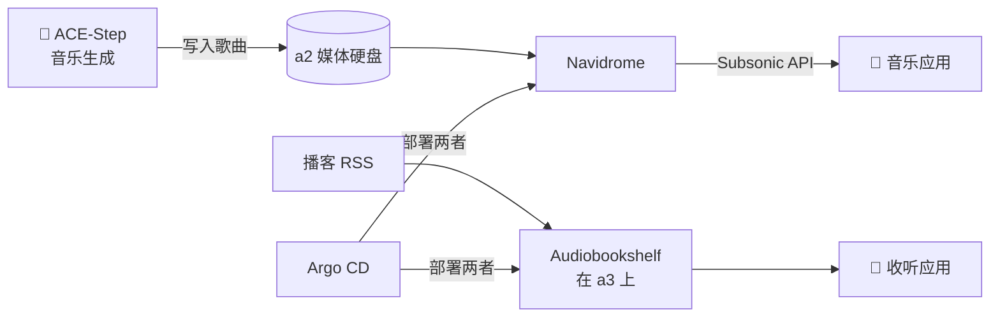

# Navidrome 与 Audiobookshelf

两个小服务器，一个理念：**你拥有的音频，理应享有租来的音频那样的串流体验**——同样的便利，但没有曲库轮盘赌。

## Navidrome：音乐服务器

**它是什么：** 一个轻量级的音乐串流服务器，服务于你自己的音乐文件。它讲 **Subsonic API**——这意味着整个生态里那些打磨精良的手机应用（播放、离线缓存、记录收听）都会把你家当成 Spotify 的数据中心。

**为什么我推荐它：** 流媒体服务会下架专辑；你的 FLAC 收藏不会。Navidrome 几乎零维护——指向一个文件夹，就能永远享受无缝播放和按用户划分的音乐库。而且它在这里还有一份妙趣横生的工作：

- **它串流 AI 生成的音乐。** 实验室的音乐生成服务（跑在 4090 上的 ACE-Step 模型）把歌曲写到媒体硬盘上，Navidrome 就像对待其他专辑一样为它们服务。当你记录收听一首"艺术家"是隔壁房间一块 GPU 的曲子时，有种安静的滑稽感。

**日常使用清单：**
- 手机上的 Subsonic 应用（客户端连 `http://192.168.5.96:30533`，Web 界面在 `https://music.lan`）
- AI 歌曲库——生成结果落到硬盘上，就出现在应用里
- 上飞机前离线缓存，从我自己的服务器缓存，不需要付费会员

{/* screenshot: media/navidrome-albums.png — album grid incl. AI-generated albums */}

## Audiobookshelf：有声书与播客

**它是什么：** 一个有声书和播客服务器，把那些大厂应用抠抠搜搜发放的功能全都给你：按书同步进度、睡眠定时器、倍速播放、章节封面、播客自动下载。

**为什么我推荐它：** 播客本质是 RSS——从来就不存在必须在谁那儿注册账号的理由。Audiobookshelf 按计划下载新单集，跨设备记住播放位置，并且把有声书伺候得妥妥帖帖（一本 40 小时的书能精确记住你在哪儿睡着的）。它安静地跑在 **a3** 上（[`clusters/home/audiobookshelf/`](https://github.com/briancaffey/home-lab/tree/main/clusters/home/audiobookshelf)）——是少数不在 a2 上的媒体服务之一，纯粹为了分散负载。

**日常使用清单：**
- 播客订阅按计划自动下载（`https://abs.lan`）
- 有声书进度在手机和浏览器之间无缝接力
- 自动生成的 "Hacker News FM" 音频节目——又一个实验室为自家书架生产媒体的例子

{/* screenshot: media/abs-library.png — audiobook shelf with progress bars */}

## 对这两个服务的实话实说

它们俩都算不上什么了不起的基础设施——而这恰恰是我推荐的原因。它们属于自托管里的"无聊家电"梯队：从 [`clusters/home/`](https://github.com/briancaffey/home-lab/tree/main/clusters/home) 部署一次，像其他服务一样由 Argo 管理，Renovate 提建议时更新一下，其余时间完全隐形。如果你的整个家庭实验室都是这种服务，你什么也学不到；但如果一个都没有，那它就只是个科学实验，而不是家用设施。混搭才是精髓。

