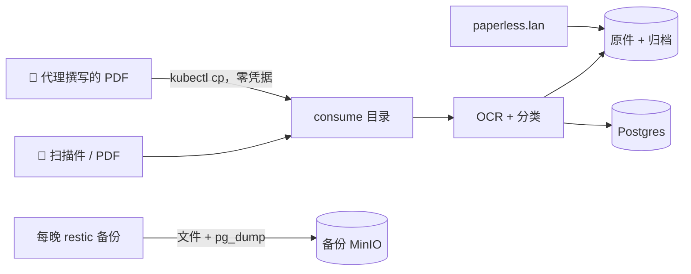

# Paperless-ngx：文档大脑

**它是什么：** Paperless-ngx 专门"吃"文档——扫描件、PDF、收据、信件、说明书——对它们做 OCR、打标签、归档，然后让你能对喂过它的一切做全文检索。纸质原件进收纳箱（或者碎纸机）；可检索的真相住在这里。

**为什么我推荐它：** "那份文件放哪儿了"从此不再是一个问题。税表、家电说明书、保险信函——在搜索框里敲两个词，它就出现在屏幕上。它也是少见的那种你越懒它越好用的自托管应用：把文件扔进去，剩下的归档交给机器。

**看看它长什么样：**

{/* screenshot: media/paperless-dashboard.png — dashboard with recent documents */}
{/* screenshot: media/paperless-search.png — full-text search hit with OCR highlight */}

## 我平时用它做什么

- 归档每一份重要的 PDF：账单、收据、说明书、合同
- 对多年积累的纸质文档做全文检索（"热水器保修" → 找到了）
- **代理生成的报告**：实验室里的 AI 代理把一项工作写成 PDF 后，它会自动落到这里——实验室在给自己写文档
- 基于标签的智能视图（按年份的税务、按电器的说明书）

## 配置里有意思的部分

清单文件在 a2 上的 [`clusters/home/paperless/`](https://github.com/briancaffey/home-lab/tree/main/clusters/home/paperless)：Web 服务、专属 Postgres、负责任务队列的 Redis，以及一组各司其职的卷——`data`、`media`（文档原件——神圣不可侵犯）、`consume` 和 `holding`。

**consume 目录是整个应用里最棒的设计决策**：任何出现在里面的文件都会被自动摄取、OCR、归档。这意味着*凡是能写文件的东西，就能归档文档*——不需要 API token，不需要登录，不需要 SDK。实验室的代理们用的正是这一招：渲染一份 PDF，用 `kubectl cp` 丢进 consume 目录，完事。一个凭据都不用发，而摄取管线对待 AI 写的报告和扫描的税表一视同仁。

每晚的备份对它足够尊重：文档原件和归档走文件级备份，Postgres 数据库用 `pg_dump` 导出——两者都进入加密的 restic 仓库。临时目录（`consume`、`holding`）被刻意排除：它们是传送带，不是书架。

## 它在整个体系中的位置

