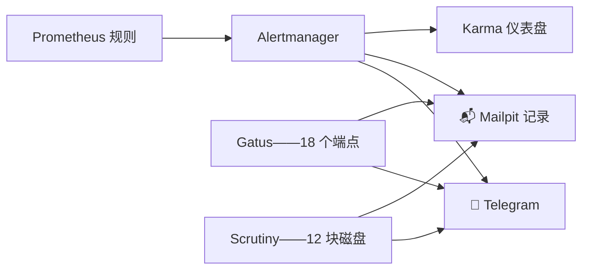

# 能找到人的告警

**这是什么：** 一条把"某个指标越线了"变成"我手机响了"的管线。Prometheus 计算规则，**Alertmanager** 负责分组和路由，**Telegram** 送达我的口袋，**Mailpit** 保留一份永在线的书面记录，而 **Karma**（`karma.lan`）是我想看全景、想静默某条告警时的仪表盘。

**它为什么存在——缺失器官的故事：** 有好几个星期，这个实验室有告警*规则*，却没有任何地方可以投递。Prometheus 尽职尽责地计算着 `VLLMTargetDown` 和它的朋友们，把它们标成 FIRING……然后射进虚空。Alertmanager 根本不存在。这个教训可以推而广之：监控教程热爱仪表盘、跳过投递环节，而一条没人收到的规则只是日记，不是告警。与此同时，账单在堆积——Jellyfin 曾经宕了*三天*、一个开发部署崩溃循环了*十三天*，才被别的东西偶然翻出来。

{/* screenshot: observability/karma.png — karma with a firing test alert */}
{/* screenshot: observability/telegram-alert.png — the phone view, redact chat details */}

**我每天从中得到什么：**
- 📱 任何真实问题 → 几秒内到 Telegram（节点宕机、磁盘快满、端点死亡）
- 🧾 每条告警*及其恢复* → Mailpit，就算我划掉了手机通知，记录永远都在
- 🖥️ 看全景用 `karma.lan`：什么在触发、怎么分的组、维护窗口静默已知问题
- 🔗 每条告警都带一个可点击的 `prometheus.lan` 链接，直达触发它的查询——点一下，看到曲线，明白问题的形状

**这套规则包是挣来的，不是抄来的。** 每条规则都能追溯到一个真实事件：5 分钟触发的 `NodeDown` 之所以存在，是因为 x1（一台笔记本节点）曾在凌晨 5:40 耗尽电池，十二个小时无人知晓。磁盘将满的规则存在，是因为这里的每个字节都住在节点本地磁盘上。而推理舰队适用一套截然不同的哲学——见下文。

**"停放不等于宕机。"** 这里的模型服务器为了共享四块 GPU 而频繁缩容到零——那是一种运维节奏，不是故障。所以推理舰队完全豁免*存在性*告警；取而代之的是**行为**规则（KV-cache 压力、请求积压、首 token 变慢），它们只在模型正经服务时*才可能*触发，停放时自动沉默。每个服务零配置，两个方向都正确。

三个告警源共享同样两条通道：Prometheus/Alertmanager（指标）、**Gatus**（18 个端点健康检查——`jellyfin.lan` 真的在应答吗？）、**Scrutiny**（磁盘健康）。一部手机，一份书面记录，谁先发现谁上报。

配置住在 [`clusters/home/monitoring/`](https://github.com/briancaffey/home-lab/tree/main/clusters/home/monitoring)；Alertmanager 的配置本身是一个带外 Secret，因为它触及 Telegram 凭据——这一页里唯一在 git 中找不到的部分，故意的。
