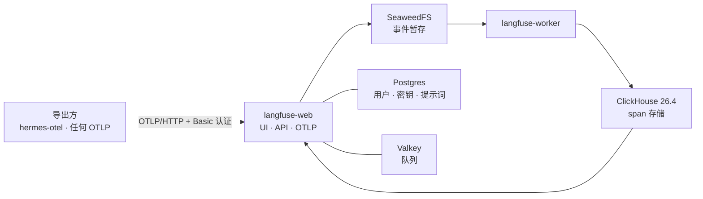

# Langfuse：智能体的链路追踪都去了哪里

**这是什么：** [Langfuse](https://langfuse.com) 是一个 LLM 工程平台——链路追踪、提示词、评估——我把它自托管在 `langfuse.lan`。当实验室里的某个智能体发起一连串模型调用时，Langfuse 就是让这串调用变成"可以*看*的东西"的地方：进去的是哪条提示词、哪个模型答的、每一步花了多久、花了多少钱。任何会说 OTLP 的东西都能往这里发链路；第一个这么做的是 [hermes-otel](https://briancaffey.github.io/hermes-otel/backends/langfuse)，也就是挡在 [Hermes](../ai/hermes.md) 前面的那层追踪垫片。

**先说实在话：** 如果你已经在跑 Phoenix——我就是——你并不*需要*第二个追踪后端。我想要它，是因为 Langfuse 是 hermes-otel 仪表盘适配器原生支持的后端，因为提示词管理和评估是我真的想试的功能，也因为真刀真枪地自托管一个"v4"产品，正是那种一定会教你点什么的事。它确实教了：第一个 span 真正通过之前，它坏了整整三天。那段故事在下面，也是这一页最有用的部分。

{/* screenshot: observability/langfuse-trace.png — a Hermes agentic run as a trace tree, spans expanded */}
{/* screenshot: observability/langfuse-project.png — the hermes-otel project overview */}

## 我拿它做什么

- **事后读智能体的脑子**——一次 Hermes 运行就是一棵 span 树；当它做了什么奇怪的事，链路会告诉你是哪一步做的决定
- **按运行而不是按模型看成本和延迟**——网关的开销页面知道总数，Langfuse 知道*哪一段对话*花得多
- **一个可查询的读取侧**——hermes-otel 的仪表盘通过 Langfuse 的公开 API 把 span 拉回来，而不用自己再存一份
- **提示词与评估**（我还没用到的部分——它们正是 v4 值得多养几个活动部件的原因）

## 它是怎么搭起来的

Langfuse 是用**官方 Helm chart 以 Helm release 的方式**部署的，和 Phoenix 一样——不走 kustomize。干活的是两个应用 Deployment：`langfuse-web`（UI、公开 API 和 OTLP 端点共用一个端口）和 `langfuse-worker`（摄取侧）。所有有状态的东西都钉在 a3 的 `local-path` 卷上：

- **Postgres**（chart 自带）——用户、项目、API 密钥、提示词
- **Valkey**（Redis 的分支，chart 自带）——web 和 worker 之间的队列
- **SeaweedFS**（chart 自带，S3 兼容）——*每一次*链路摄取都先暂存到这里的一个桶，再由 worker 接手
- **ClickHouse**——span 真正落地的分析存储。这个我自己跑，单节点 StatefulSet，因为 chart 自带的 ClickHouse 路线要求上游的 ClickHouse operator 加一个 Keeper 集群——为了一台机器，这是一大堆 alpha 阶段的机器

摄取是异步的——web 把事件写进 S3，worker 再把它搬进 ClickHouse——所以 span 会在导出几秒之后才出现在 UI 里，而不是立刻。先知道这一点，免得白慌。

**访问方式：** 局域网内是 `https://langfuse.lan`（Traefik + mkcert 证书，Homepage 会在"Observability"分组下自动发现它）；在外面通过 Tailscale operator 走 `https://langfuse.<tailnet>.ts.net`。导出方向 `/api/public/otel/v1/traces` 发送，用 Basic 认证（项目 public key 当用户名，secret key 当密码）；集群内部可以直接打到 `observability` 命名空间里的 `langfuse-web` 服务，跳过 TLS。

**首次登录：** chart 支持无头引导——在数据库为空的第一次启动时，它会根据 `LANGFUSE_INIT_*` 环境变量创建一个组织、一个项目、一个用户，以及该项目的 API 密钥。这些值全部来自一个从不进 git 的集群内 Secret（[README](https://github.com/briancaffey/home-lab/tree/main/observability/langfuse) 里写了怎么生成和读回）。微妙之处在于：这些 init 值只生效*一次*，而应用的 salt 和加密密钥在有数据之后绝不能再改，否则每一个 API 密钥的哈希都对不上了。

一切都在这里：[`observability/langfuse/`](https://github.com/briancaffey/home-lab/tree/main/observability/langfuse)——`values.yaml` 是 release 的配置，`clickhouse.yaml` 是 StatefulSet，`ingress-lan.yaml`，还有一个 `smoke-test.sh`，我一会儿解释。

:::warning[🔥 War story]
第一次安装是周五上线的。到周一，`langfuse-web` 已经重启了 **649 次**，没有一个 span 通过。四件事同时出了错，而且它们互相掩护。

**1. 存活探针杀掉了迁移。** 首次启动时，web pod 会在提供健康端点之前跑完所有 Prisma 迁移——对着空数据库是 438 个，在 a3 上要好几分钟。chart 默认的存活探针只给它大约 50 秒。它在迁移中途杀掉了容器，Prisma 把那个迁移记为*失败*，从此每次启动都拒绝再碰数据库（`Error: P3009`）。修复分三步：在 values 里把存活窗口放宽到 10 分钟，让它不可能再发生；对失败的那个迁移执行 `prisma migrate resolve --rolled-back`；还有一步我怎么也猜不到的——删掉一个*无效*的 Postgres 索引。那个迁移用的是 `CREATE INDEX CONCURRENTLY`，它不是事务性的，所以被杀之后留下了一个建到一半的索引，重跑时死在了"already exists"上。

**2. ClickHouse 太旧。** Postgres 通了以后，ClickHouse 迁移开始跑——第 0039 号迁移失败，报"Only literals can be skip index arguments"。Langfuse v4 使用的文本跳数索引要求 ClickHouse 25.12 或更新（推荐 26.4）；我的 StatefulSet 是 25.3。golang-migrate 在失败时会把 schema 标为 *dirty* 并拒绝继续，所以修复是把镜像升到 26.4.5，再手动把版本指针拨回最后一个成功的迁移。

**3. ClickHouse 在吃自己。** 追查上面这些问题时，我注意到 ClickHouse pod 在 OOM。它自己的性能分析日志（`system.trace_log`）**在一台空闲实例上三天写了 4 GB**，合并这些分片直接冲破了 4 GiB 的内存上限。现在通过 StatefulSet 的 ConfigMap 里的一个 `config.d` 覆盖把它关掉了，上限也提到了 8 GiB。

**4. 我用来测试的那个 API 已经不存在了。** span 终于流起来之后，我的"读一条回来"检查返回 404——因为 Langfuse v4 是"仅事件"模式：v3 的读取端点（`/api/public/traces`、`/observations`、`/metrics`）都没了，读取侧是 `/api/public/v2/observations`。那些 span 其实已经在那里躺了一个小时；我敲的是错的门。

这一切留下的好东西是 [`smoke-test.sh`](https://github.com/briancaffey/home-lab/blob/main/observability/langfuse/smoke-test.sh)：健康检查 → 用引导密钥做 OTLP 导出 → 轮询 v2 API 直到 span 回来。这是我第一天就该有的检查，现在"Langfuse 正常"的定义就是它。每种故障的恢复步骤都写进了 README，因为我不相信自己在压力之下还能记得 `migrate resolve`。
:::

## 它和其他部分怎么配合

- **[Hermes](../ai/hermes.md)** 的链路经 hermes-otel 到达这里，它是第一个、目前也是主要的导出方。它的仪表盘也从 Langfuse *读取*数据，所以两者是一对搭档。
- **[LiteLLM](../ai/litellm.md)** 今天的 OTLP 导出去的是 Phoenix；把它指向 Langfuse 的 OTLP/HTTP 端点同样轻而易举，那样每一次网关调用——不只是智能体运行——都会进同一个追踪存储。等我决定了两个后端里哪个是长期的家，这就是显而易见的下一步。
- **Phoenix** 继续留着。两个追踪后端比一个家庭实验室需要的多了一个，我会合并——但要等到把两个都用够了、有了观点而不只是偏好之后。
- **然后变成了九个。** 当 hermes-otel 支持的每一个可自托管后端都搬到隔壁之后——OpenObserve、Jaeger、Tempo、SigNoz、Uptrace、Parseable 和一个 OTel Collector 网关——两个变成了九个。Langfuse 仍然是我真正会打开来*读*链路的两个之一；其余的是对照组，它们有[自己的页面](./otel-backends.md)。
