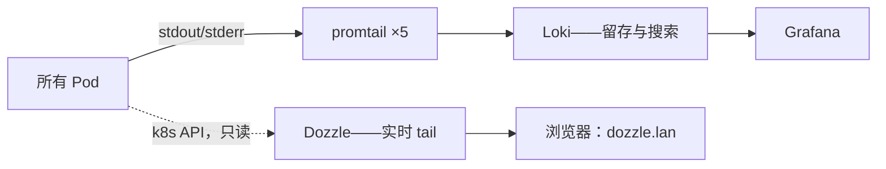

# 日志：留档与 tail -f

**这是什么：** 两个互补的日志工具。**Loki**（由每个节点上的 promtail 喂养）是档案馆——它回答*"那个 Pod 上周二凌晨三点说了什么？"* **Dozzle** 是现场直播——一个 Web 界面，用实时流、多 Pod 分屏和搜索来回答*"这个 Pod 现在正在喊什么？"*

**为什么两个都要：** 因为这是两个不同的问题。翻旧账需要索引和留存；看一个模型服务器加载权重需要零配置的实时流。我试过假装一个工具能兼任两者。做不到——而且这一对加起来比那个折中方案还便宜。

{/* screenshot: observability/dozzle-tail.png — dozzle streaming a model load, split view */}

**我每天用它们做什么：**
- 🔴 部署时开着 **Dozzle**：实时看 Pod 起来，而不是反复跑 `kubectl logs -f`
- 🕰️ 告警说昨晚出事了、我需要完整故事时，用 **Loki**（通过 Grafana）
- 🧵 两个服务互相通信时用 Dozzle 的分屏，同时看对话的两边
- 🔍 躺在床上用手机实时围观长时间操作——模型下载、备份任务、CI 构建

**它是怎么接起来的：** promtail 是一个 DaemonSet，把每个容器的日志运往 Loki。Dozzle 是单个小 Pod，跑在 **Kubernetes 模式**——任何地方都不需要 agent；它通过 Kubernetes API 读日志，用的是一套刻意收窄的只读权限（[`clusters/home/dozzle/`](https://github.com/briancaffey/home-lab/tree/main/clusters/home/dozzle)）。而且和我大多数 `.lan` 工具不同，Dozzle 要求**登录**：Pod 日志正是流浪 token 和数据库连接串最终落脚的地方，所以"反正只在我的局域网里"在这儿不够格。密码哈希用的是 bcrypt，因为 Dozzle 自己在一份安全公告里放弃了 SHA-256 支持——上游逼着你讲卫生的好例子。

**什么时候用哪个：** 事情*正在*发生，用 Dozzle。事情*已经*发生，用 Loki。不知道什么时候发生的，先去 Mailpit 里找那条告警——它带时间戳，而那个时间戳离完整故事只差一条 Loki 查询。
