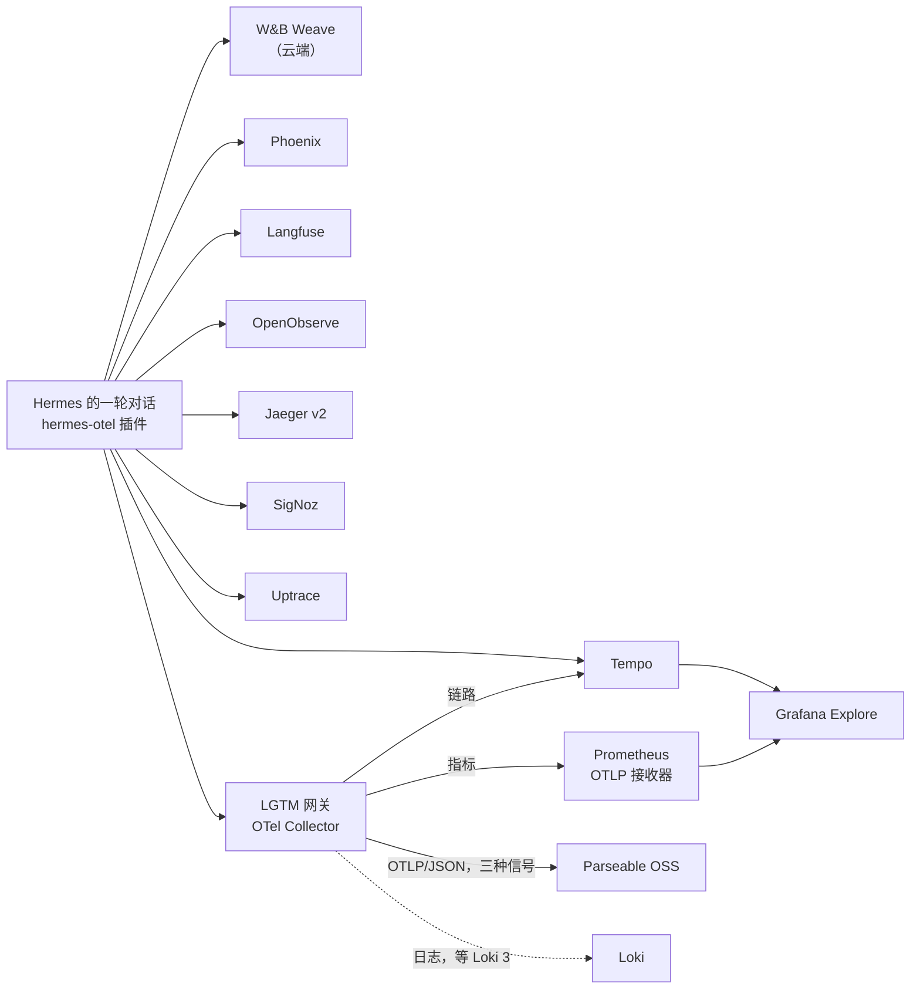

# 智能体的一轮对话，九个后端

**这是什么：** `observability` 命名空间里的一整排 OpenTelemetry 后端——OpenObserve、Jaeger、Grafana Tempo、一个充当"LGTM"的 OTel Collector 网关、Parseable、SigNoz 和 Uptrace，挨着原本就在的 [Langfuse](./langfuse.md) 和 Phoenix。每一个都是用**官方 Helm chart** 以 Helm release 的方式部署的，values 提交在 [`observability/<name>/`](https://github.com/briancaffey/home-lab/tree/main/observability) 下。而 [Hermes](../ai/hermes.md) 每进行一轮对话，[hermes-otel](https://github.com/briancaffey/hermes-otel) 插件都会把这一轮同时扇出到*所有*后端。一次智能体运行，九份链路副本，九个可以互相对照的 UI。

**先说实在话：** 没有人需要九个链路追踪后端。我也不需要。我需要的是：hermes-otel 这个插件——我在维护它，它声称支持这些后端——得*在一个我能登录进去的真实后端上被验证过*，而不是对着一个文档页面。现在这个声明已经用最字面意义的方式核实了：发出了一次真实的 `/v1/runs` 对话，链路在每一个后端里都出现了。附带的收获是，我现在对这些工具各自的看法来自亲手安装它们，而不是读它们的落地页。这一页就是那些看法加上踩过的坑，而整排后端的设计初衷，就是等新鲜劲过了，可以一条 `helm uninstall` 一个地拆掉。

{/* screenshot: observability/otel-backends-homepage.png — the Observability group on Homepage with all nine tiles */}
{/* screenshot: observability/otel-backends-same-trace.png — the same Hermes trace open in Jaeger, SigNoz and Uptrace side by side */}

## 矩阵

| 后端 | hermes-otel `type` | 链路 | 指标 | 日志 | 去哪里看 |
|---|---|---|---|---|---|
| Arize Phoenix | `phoenix` | 有 | — | — | `phoenix.lan` |
| [Langfuse v4](./langfuse.md) | `langfuse` | 有 | — | — | `langfuse.lan` |
| OpenObserve | `openobserve` | 有 | 有 | 有 | `openobserve.lan` |
| Jaeger v2 | `jaeger` | 有 | — | — | `jaeger.lan` |
| Grafana Tempo | `tempo` | 有 | — | — | Grafana Explore |
| LGTM 网关（OTel Collector） | `lgtm` | 有 | 有 | 等 Loki 3 | Grafana |
| SigNoz | `signoz` | 有 | 有 | 有 | `signoz.lan` |
| Uptrace | `uptrace` | 有 | 有 | 有 | `uptrace.lan` |
| Parseable OSS | 经网关 | 有 | 有 | 有 | `parseable.lan` |

七个新来的共用同一套配方：钉在 **a2**（还有余量的那台机器）、`local-path` PVC、带 mkcert 证书的 `<name>.lan` Traefik ingress、一块 Homepage 磁贴，所有凭据都由 External Secrets 从 Vaultwarden 条目送达——git 里没有任何敏感内容。chart 版本、端点，以及精确的部署/拆除命令，都写在 [`observability/`](https://github.com/briancaffey/home-lab/tree/main/observability) 下各后端的 README 里；顶层的 [`observability/README.md`](https://github.com/briancaffey/home-lab/blob/main/observability/README.md) 是上面这张表的权威版本。

插件里每个后端都有自己的导出队列，所以扇出是非阻塞的：一个被缩容或卸载的后端，代价只是几行"批次丢弃"的日志，别无其他。后端列表本身是 [`clusters/home/hermes/`](https://github.com/briancaffey/home-lab/tree/main/clusters/home/hermes) 里的一个 ConfigMap——把某个后端注释掉、push，Hermes 就不再往那里发了。

## 每个后端，一段实话

**OpenObserve** 是这一排里能接收全部三种信号的最轻的东西：一个 pod，嵌入式 SQLite 存元数据，parquet 落在一块 PVC 上。如果非要我为一个小实验室从新来的里面只留一个，大概会是它。OTLP 端点用 Basic 认证，保留 14 天，还有一条密码策略，把我第一次尝试的管理员密码拒了。

**Jaeger v2** 现在是一个基于 OpenTelemetry Collector 的单二进制，官方 chart 也是这个思路：存储通过 v2 的 `userconfig` 块配置，而不是 chart 的开关。chart 默认是内存存储，所以我的 values 换成了 PVC 上的 Badger，span 保留 7 天。两件值得知道的事：chart 用 `subPath` 挂载配置，所以改了 values *不会*传到正在运行的 pod，要重启 Deployment；还有查询 API 挪到了 `/api/v3/…`——每篇教程都在用的 v1 `/api/services` 路径现在是 404。

**Grafana Tempo** 自己没有 UI；它是一个让 Grafana 来读的链路存储，所以这里的改动既是一个 Helm release，也同样是一个 Grafana 数据源。chart 的坑在于 *chart 住在哪儿*：Grafana 社区 chart 在 2026 年 1 月搬到了 `grafana-community.github.io`，旧仓库里的 `grafana/tempo` 是一个停在 1.24.x 的陈旧版本。链路会到达两次——一次直接来自插件的 `tempo` 后端，一次经网关的 `lgtm` 后端——这正是目的：两条路都得到了验证。

**LGTM 网关**是那个其实不算后端的东西。hermes-otel 的 `lgtm` 类型的意思是"一个 OTLP 接收器，后面站着 Grafana"，在笔记本上那就是 `grafana/otel-lgtm` 演示容器——没有 chart，没有持久存储，明确不打算移植。所以 k3s 上的替身是一个 **OpenTelemetry Collector**（contrib 镜像，官方 chart），在 `:4318` 接收，然后扇出到真正的组件：链路去 Tempo，指标去 Prometheus（需要加 `--web.enable-otlp-receiver` 这个开关），三种信号再全部重新编码成 OTLP/JSON 送给 Parseable。日志是缺口：实验室的 Loki 是 2.9，没有 OTLP 端点，而 collector-contrib 已经删掉了 `loki` 导出器，所以日志管道先送到 `debug` 导出器，等 [Loki 3 迁移](./logs.md)落地。

**Parseable OSS** 是网关长出 JSON 这条腿的原因。hermes-otel 有一个用 API key 认证的 `parseable` 类型——那是 Parseable Cloud/Enterprise 的功能；OSS 没有 `/api/v1/apikeys`，任何带这个头的请求都会得到 401。而且 OSS 对 OTLP/protobuf 直接回 `400 Protobuf ingestion is not supported`，而 Python 导出器只会发 protobuf。所以插件根本不直接和 Parseable 说话：collector 重新编码成 JSON，加上 Basic 认证和按信号区分的 `X-P-Stream` 头，Parseable 的 `hermes-traces` / `hermes-metrics` / `hermes-logs` 数据集在第一次摄取时自动出现。

**SigNoz** 是新来的里面最重的——空闲时大约 2–3 GB 内存——因为 chart 通过自带的 Altinity operator（集群级的，注意）带来了自己的 ClickHouse，外加一个 ZooKeeper、它自己的 OTel collector 和一个 schema 迁移 Job。首次启动是几分钟的多米诺骨牌。花掉我最多时间的坑写在下面的战地故事里：在第一个管理员用户和组织存在之前，collector 什么都不接收。

**Uptrace** 2.0 的 chart 只装应用，它自带的存储是*operator CR*——一个 Altinity `ClickHouseInstallation`、一个 CloudNativePG `Cluster`、一个 `OpenTelemetryCollector`。为一个开发用后端装三个 operator 太多了，所以三个全部禁用，存储换成两个普通的 StatefulSet（ClickHouse 25.3 和 Postgres 17），再加上共享的平台 Redis。values 文件里的每一条凭据都是 Uptrace 从环境变量里展开的 `${VAR}`，正好是 External Secrets 擅长的形状。它每次重启都会记一条 seed fixture 错误（在已存在的组织上重新应用种子数据），然后照常运行；忽略即可。

:::warning[🔥 War story]
**没人在读的后端列表。** 第七个后端起来之后，每个 OTLP 端点对手工拼的冒烟请求都返回了 200，我发了一次真实的 Hermes 对话——链路去了 *Langfuse Cloud*。不是我配置里九个后端中的任何一个。插件在运行；它只是没有读我的文件。

安装步骤把插件配置种到了 `/opt/data/.hermes/plugins/hermes_otel/`，那是旧 fork 分支查找的位置。1.x 的插件在 `HERMES_HOME=/opt/data` 下，查找的是 `/opt/data/plugins/hermes_otel/`（init 容器每次启动都会清空重装）或者 `/opt/data/hermes_otel.yaml`。两者都不存在，于是插件退回到环境变量自动检测，在 pod 的环境里找到了一对长得像 Langfuse 的密钥，热心地把自己配成了 Langfuse *Cloud*。我之前看到的每一个"摄取 OK"，都是插件带着一份我没写过的配置在完美工作。

修法是最无聊的那种：ConfigMap 挂载到 `/etc/hermes-otel/`，`HERMES_OTEL_CONFIG`——插件优先级最高的配置路径——直接指向它。卷上不再种副本，重启也没东西可清，改配置就是一次 git push（Reloader 滚动 pod）。两条我不断换着措辞记下来的教训：**"端点返回了 200"测试的是后端，不是发送方**；而一个带热心自动检测的插件，在你的显式配置被悄悄忽略时，总会找到*点什么*来做。

**什么都不接收的 collector。** SigNoz 起来时一片绿——每个 pod 都是 Running——而它的 collector 的 4318 端口是关着的。collector 启动时通过 OpAMP 向 SigNoz 应用注册，而在应用里第一个用户和组织存在之前，这次注册会失败（`failed to find or create agent`）。通过 API（或 UI 的首次运行页面）注册管理员，过一会儿 collector 就把端口打开了。顺序是*先注册，再摄取*，而 chart 里没有任何地方告诉你这一点。
:::

## 有意不放在这里的东西

- **仅 SaaS 的 hermes-otel 后端**——LangSmith、Honeycomb、telemetry.dev 和 W&B Weave——不可自托管，也没有被模仿。Weave 继续作为云端后端留在同一个扇出里，所以插件的云端路径和集群内的路径一起被验证。
- **Argo CD 不管理这些 release。** 和 Phoenix、Langfuse 一样，它们是从笔记本上 `helm upgrade --install` 的，values 在 git 里；一排会被拆了重建的开发用后端，不需要一个控制器来跟它较劲。*确实*由 Argo 管理的部分——Hermes 的配置、External Secrets、Prometheus 的开关、Grafana 数据源——只有在 push 之后才生效。
- **高可用、复制存储，任何生产形态的东西。** 单节点、单副本、`local-path`。它们的存在是为了被看，不是为了被依赖。

## 它和其他部分怎么配合

- **[Hermes](../ai/hermes.md)** 是今天唯一的发送方。插件每次启动都从一个钉住的 hermes-otel release 标签安装，所以"Hermes 跑的是哪个版本的插件"就是 deployment 里的一行。
- **[Langfuse](./langfuse.md)** 和 Phoenix 保留各自的页面和各自存在的理由；它们是我真正会打开来读链路的两个。其余的是对照组。
- **[Prometheus 与 Grafana](./prometheus-grafana.md)** 多了一个 OTLP 接收器和一个 Tempo 数据源，所以在我本来就常驻的那个 Grafana 里，一条 Hermes 链路只差一句 TraceQL 查询。
- **[日志](./logs.md)** 是没做完的那条边：网关的日志管道在等 Loki 3。
