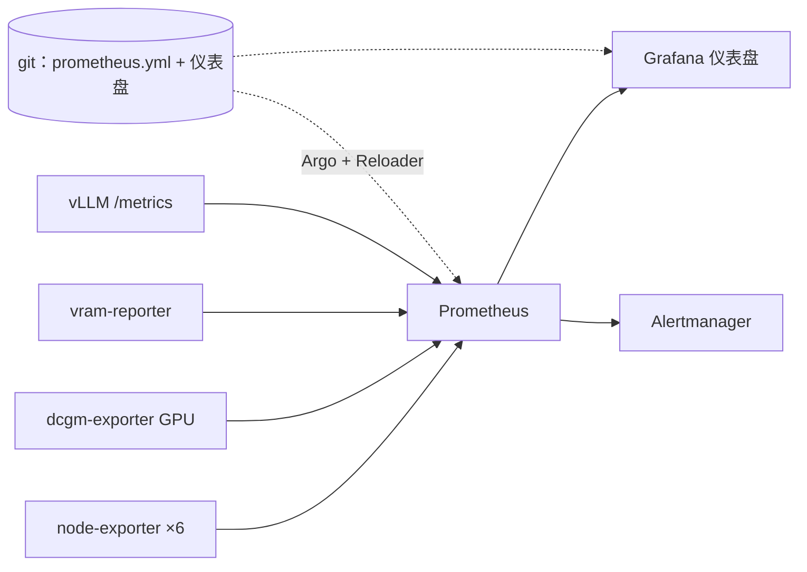

# Prometheus 和 Grafana：故意手搓

**这是什么：** Prometheus 每五秒从实验室的一切东西上抓取数字——CPU、磁盘、GPU 温度、某个模型每秒生成多少 token——Grafana 再把这些数字变成我真的会去看的仪表盘。这是集群的记忆：当什么东西"感觉很慢"的时候，这里是"感觉"变成"事实"的地方。

**我为什么这么跑：** 大多数 Kubernetes 教程会把你推向 Prometheus *Operator*——一套从散落在各命名空间的自定义资源里生成监控配置的系统。它很强大，对公司来说是正确选择。但对一个学习型实验室，它有个致命缺陷：**你读不懂它**。我的方案是一个单独的 `prometheus.yml`，用朴素的 `static_configs`，加一个装满仪表盘 JSON 文件的文件夹，全都住在 [`clusters/home/monitoring/`](https://github.com/briancaffey/home-lab/tree/main/clusters/home/monitoring)。想知道在抓什么，我读一个文件。智能体要新加抓取目标，它改一个文件。这份可读性对我来说比动态发现值钱得多。

{/* screenshot: observability/grafana-gpu.png — the GPU fleet dashboard, dark mode */}
{/* screenshot: observability/grafana-nodes.png — node overview */}

**我每天用它做什么：**
- 📈 **GPU 舰队仪表盘**——哪块 4090 在忙、多热、每个 Pod 占了多少 VRAM（靠一个叫 `vram-reporter` 的迷你自制导出器，因为共享 GPU 对调度器是隐形的）
- 🌡️ 节点健康一览——六台机器，一台一行
- 🚀 vLLM 服务指标——tokens/秒、首 token 延迟、模型加载时的 KV-cache 压力
- 📶 家庭宽带速度历史（一个 speedtest 导出器喂养的仪表盘，专治和运营商吵架）
- 🧾 告警链接直达触发表达式时，`prometheus.lan` 的原始查询控制台

**它是怎么接起来的（跳过无聊部分）：** node-exporter 跑在全部六台机器上；dcgm-exporter 读 NVIDIA GPU；vLLM 服务器原生暴露 `/metrics`。仪表盘是*文件供给*的——JSON 在 git 里，挂载进 Grafana——所以"存在哪些仪表盘"以仓库为准。保留期 15 天，对付"这事是什么时候开始的？"绰绰有余。

**可读性的代价：** 手写 `static_configs` 的另一面是，加一个新节点是一次手工编辑，而不是自动发现。t430 加入时，它的 node-exporter DaemonSet 立刻就跑起来了，但在我手动把目标加进 `prometheus.yml` 之前，Prometheus 不会去抓它——而在我把它的 IP 加进烤进 fleet 仪表盘 JSON 里的节点标签映射之前，它的温度那一行一直是空的。换成 Operator，它会自己发现这个节点。我仍然接受这个取舍：我宁愿每加一个节点就编辑一个读得懂的文件，也不想在其余所有时间里运行一套我读不懂的系统。但这是实打实的成本，而且恰恰是那种在节点加入后"就这么好用了"时最容易忘掉的步骤。

真正有点绕的只有一处：配置文件放在**名字固定**的 ConfigMap 里（没有内容哈希后缀），这曾经意味着改一个仪表盘就得手动重启 Grafana。那个时代在 [Reloader](https://github.com/briancaffey/home-lab/tree/main/clusters/home/reloader) 加入集群后结束了——现在一次配置提交会自动滚动重启对的 Pod，整个闭环（改 JSON → push → Argo 同步 → Reloader 重启 → 仪表盘上线）零 kubectl。

