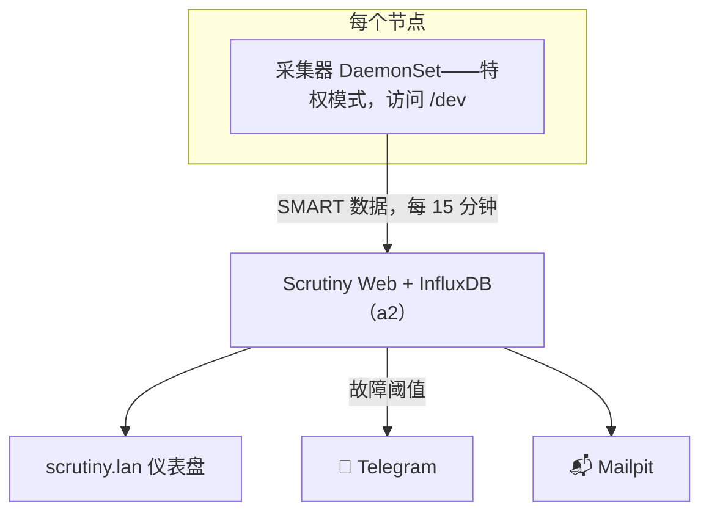

# Scrutiny：看着磁盘变老

**这是什么：** Scrutiny 读取每块机械盘和 SSD 默默记录的 S.M.A.R.T. 健康数据——重映射扇区数、温度历史、通电小时数——把它们变成一个仪表盘（`scrutiny.lan`），并在某块盘开始暗示自己快不行了的时候发出告警。

**为什么在这里它是生死攸关而非锦上添花：** 这个集群的存储是故意做得很无聊的——节点本地磁盘、没有复制，靠每晚备份兜底。这个设计只有一条硬性要求：**你必须在磁盘坏掉*之前*知道它在坏。** 早期发现的垂死磁盘意味着一个从容的周末：`rsync` 一下，再去买块新盘。挂载时才发现的死盘则意味着一场肾上腺素飙升的恢复演练。Scrutiny 就是这两者之间的差别，而它的价格只是一个小小的 DaemonSet——全实验室最便宜的保险。

{/* screenshot: observability/scrutiny-dashboard.png — 12 drives, all green */}
{/* screenshot: observability/scrutiny-drive-detail.png — temp history on one of a2's HDDs */}

**我用它做什么：**
- 💚 每周瞟一眼 `scrutiny.lan`：五台机器十二块盘，最好全绿
- 🌡️ 节点位置或负载变化时看温度历史（备份任务搬进来之后，那块机械盘是不是一直很热？）
- 📉 带故障率上下文的 SMART 属性趋势——Scrutiny 会告诉你*和你同款的盘*在这些数值下的下场，而不只是裸数字
- 📱 大部分时候什么都不做：故障阈值告警会自己去 Telegram 和 Mailpit；安静本身就是功能

**它是怎么接起来的：** 中心辐射式（hub-and-spoke），代码在 [`clusters/home/scrutiny/`](https://github.com/briancaffey/home-lab/tree/main/clusters/home/scrutiny)。中心（Web 界面 + 一个存历史的小 InfluxDB）住在 a2。辐条是**每个节点**上的采集器 DaemonSet——而这些采集器，值得骄傲地说，是**整个集群里唯一的特权（privileged）工作负载**。读原始 SMART 数据就是得直接跟 `/dev` 打交道；这就是它的本职工作，所以这份特权是诚实的。采集器每 15 分钟上报一次；通知走和其他所有东西相同的 Telegram + Mailpit 通道。

它盯着的这份硬件清单本身就在讲这个实验室的故事：a2 的一对 NVMe 加几块大机械盘（包括存放备份的那块 6TB——一块磁盘看守着守护其他磁盘的磁盘）、a3 的媒体盘、a1 的杂牌军，还有笔记本和 Spark 里的 NVMe。甚至还有一个幽灵：Longhorn 的 iSCSI 卷会以 `IET VIRTUAL-DISK` 的身份出现——一块其实是"穿着风衣的复制卷"的"磁盘"——可以无视，但它有趣地提醒着我们：块设备是一种社会建构。

