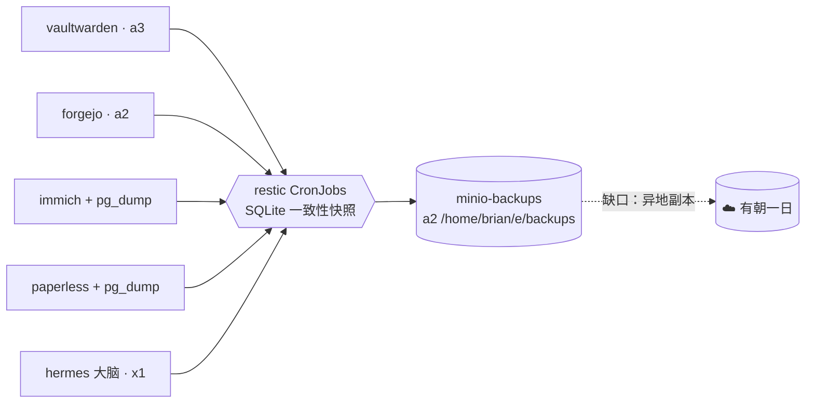

# 备份：未经测试的备份只是传闻

**它是什么。** 一组每晚运行的 [restic](https://restic.net/) 任务，把集群里所有不可替代的数据复制到 a2 那块 5.5 TB 大硬盘上的专用 MinIO（S3 兼容）存储中。加密、去重、按策略保留——而且最关键的是，**做过恢复演练**。

**我为什么需要它。** 我的存储哲学是刻意的无聊：节点本地磁盘，不做复制。这种选择想要站得住脚，前提是备份必须是真的。这里的信条有两句：*复制是为了可迁移，备份是为了保命*——以及*未经测试的备份只是传闻*。这套系统上线那天，直到一份备份被解密、恢复、读回校验之前，都不算完工。

**第一原则：只备份互联网无法恢复的东西。**

| 每晚备份 | 刻意不备份 |
|---|---|
| Vaultwarden 的凭据数据库（03:00） | 容器镜像（Harbor 会重新拉取） |
| Forgejo——每个仓库以及每一条 issue（03:20） | AI 模型权重（可重新下载） |
| Immich 照片 + 它的 Postgres 导出（03:40） | 代理缓存 |
| Paperless 文档 + 数据 + Postgres 导出（04:00） | 种子下载 |
| Hermes 的大脑——SOUL.md、技能、记忆（04:20） | 一切 initContainer 能重新生成的东西 |

**它是这样接线的：**

**这些细节各个都值回票价：**

- **绝不和你要保护的东西共享节点。** 备份 MinIO 在 a2 的硬盘上——和 Vaultwarden（a3）、Hermes（x1）*既不同节点也不同盘*。它和平台 MinIO 是各自独立的实例，这是刻意的。
- **SQLite 用一致性快照**，不是裸文件复制——粗暴地复制一个带 WAL 的活数据库可能会撕裂数据。Postgres 数据库用版本严格匹配的客户端做正经的 `pg_dump`。
- **保留策略：** 14 份每日 + 8 份每周快照，运行时顺带清理，且每晚附带 10% 的读回完整性校验。
- **托管的循环依赖：** restic 的加密密码同时存在 Vaultwarden *和* macOS Keychain 里——因为一个只存在 Vaultwarden 里的密码，永远解不开 Vaultwarden 自己的备份。停下来想一秒钟；这种陷阱只有在脑子里把恢复路径走一遍才能发现。

**恢复演练。** 一个一次性 Pod 恢复了 Vaultwarden 的最新快照，解密并读取了数据库：`integrity_check: ok`，2 个用户、25 条密码、1 个组织。是那一刻——而不是第一次备份成功——让这一页配得上它的标题。

**诚实的缺口：** 目前每一份快照都和原件住在同一栋房子里。异地副本（在 B2/S3 或朋友的机器上放第二个 restic 仓库）是已知缺失的那一层，已立项跟踪，等一个目的地的决定。
