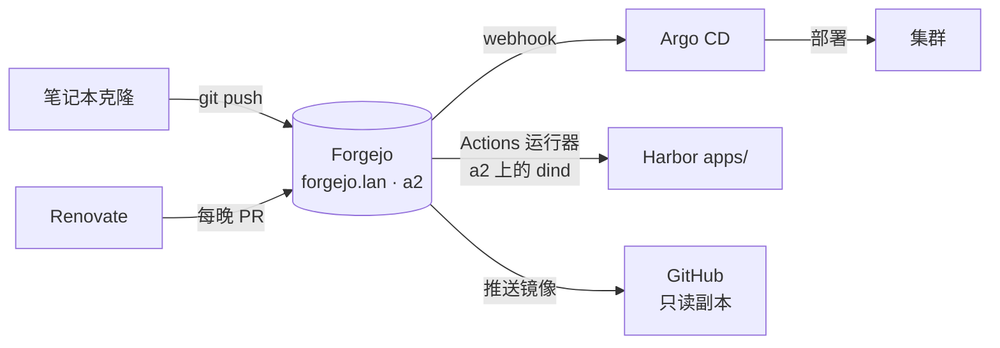

# Forgejo：家里的 Git

**它是什么。** Forgejo 是一个自托管的 Git 锻造场（forge）——可以理解为 GitHub，但只是一个跑在你自己硬件上的轻量服务。仓库、issue、Pull Request、webhook，还有内置的 CI 系统（Actions，工作流与 GitHub 的兼容）。我的这台跑在 a2 上，地址 `https://forgejo.lan`。

**我为什么需要它。** 这里是整个实验室的**作战远端（operative remote）**：Argo CD 从这里克隆期望状态，Renovate 在这里提依赖更新 PR，CI 在这里跑，而在这里合并一个 PR——毫不夸张地说——就是软件部署进我集群的方式。GitHub 依然在画面里，但只是一个只读镜像。重心在家里。

**看看它长什么样。**

{/* screenshot: platform/forgejo-repo.png — the home-lab repo with PRs tab showing renovate PRs */}
{/* screenshot: platform/forgejo-issue-43.png — the GitOps rollout tracker issue as ops logbook */}

**它每天做什么：**

- **供奉真相**：Argo CD 从这里读取 `brian/home-lab`，让集群向它看齐
- **接收机器人 PR**：Renovate 每晚的依赖更新提案落在这里，身上贴着风险等级标签
- **跑 CI**：Actions 运行器（a2 上的 Docker-in-Docker）构建应用镜像并推送到 Harbor
- **记运维日志**：这里的 issue 不只是待办清单——GitOps 迁移追踪 issue 是一本逐任务的实验室日记，每条评论都带着证据链接。未来的我时刻在感谢过去的我
- **镜像到 GitHub**：推送镜像自动转发 `main`，于是仓库同时活在三个地方（Forgejo、GitHub、我的笔记本）——对代码本身来说，这就是真正的灾备答案

**它的形状：**

**自我指涉的快感：** Forgejo 本身也由 Argo CD 部署——而 Argo 的部署指令*是从 Forgejo 读的*。这个环甚至自己证明了自己：把 Forgejo 纳入管理的那次同步，正是 Argo 从 Forgejo 克隆代码、从而得知自己应该管理 Forgejo。这听上去多么令人眩晕，它实际上就多么令人眩晕——所以除非人类提交了变更，自动化对 Forgejo 一律不出手（[selfHeal 是关的](../gitops/the-trio.md)），也所以破窗预案是在迁移*之前*就写好的。
