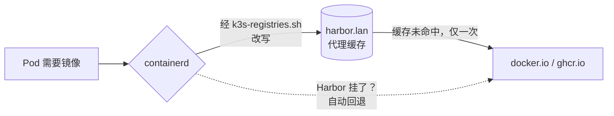

# Harbor：站在中间的镜像仓库

**它是什么。** Harbor 是一个功能齐全的私有容器镜像仓库——项目管理、访问控制、Web 界面，还内置了 Trivy 漏洞扫描器。我的这台跑在 a2 上，地址 `https://harbor.lan`，并且*站在*集群每一次镜像拉取的*中间*。

**为什么我推荐它。** 两个理由，都是在没有它的日子里才体会深刻的。第一：我的集群全靠 WiFi，动辄几 GB 的镜像曾经是*每个节点各自*从互联网拉一遍。Harbor 的**拉取直通代理缓存（pull-through proxy cache）**意味着互联网只被访问一次；之后每个节点都以局域网速度拉取。第二：一旦你开始构建自己的镜像（CI 流水线会确保你走到这一步），它们总得有个不是公共仓库的家。

**看看它长什么样。**

{/* screenshot: platform/harbor-projects.png — project list: apps, library, dockerhub, ghcr */}

**它每天为我做什么：**

- 集群里每一次 `docker.io` 和 `ghcr.io` 拉取都被静默改写，走 `dockerhub/` 和 `ghcr/` 代理项目——第一次拉取填充缓存，之后全部是局域网速度
- 存放自建镜像：`apps/`（CI 构建的，比如 rampart）和 `library/`（手动推送的）
- **每个推送的镜像自动做 Trivy 扫描**——每个制品在界面里都带着一份漏洞报告
- Harbor 自己挂了会自动回退到上游：它是缓存，不是新的单点故障

**拉取路径：**

**配置里最刁钻的一处：** Harbor 的 Helm chart 在*每次渲染*时都会重新生成四个内部密钥，这会让 GitOps 控制器和它永远打架。在 Argo CD 下，它带着一组精确到字段的 `ignoreDifferences` 运行，同步永远不会轮换它的信任令牌——当年靠"渲染两次做差异比对"找出这些字段的过程，是这个仓库里我最得意的侦探工作之一。详情见[循环依赖三人组](../gitops/the-trio.md)。
