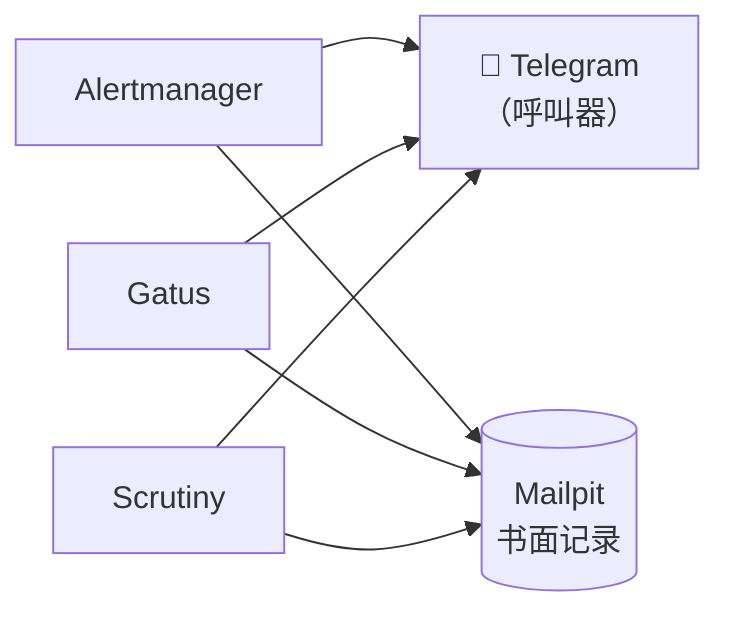

# Mailpit：机器人的收件箱

**它是什么。** Mailpit 是一台配了真收件箱的假邮件服务器。它在 1025 端口接收任何来源的 SMTP——不要认证、不要 TLS——但它不会把邮件投递到任何地方，而是在 `https://mailpit.lan` 的清爽网页界面里展示出来。可以把它想成一个带观察窗的 `/dev/null`。

**为什么我推荐它。** 每个服务迟早都想发邮件——告警、密码重置、摘要报告——而接真邮件（Gmail 应用专用密码、SES、送达率）是你搭建阶段最不想碰的摩擦。Mailpit 直接消灭了这个问题：把*所有东西*指向这个黑洞，每封邮件即时可见，而且给未来某天需要真邮件时留了一条一行配置的迁移路径。在这个实验室里，它已经从测试工具晋升为承重角色：**每一条告警的永久备份通道**。

**看看它长什么样。**

{/* screenshot: platform/mailpit-inbox.png — inbox showing alertmanager FIRING mails and a scrutiny disk alert */}

**每天有什么落进来：**

- **Alertmanager** 的通知——每条触发和恢复的告警，构成一份可搜索的书面记录，而真正的呼叫由 Telegram 负责
- **Gatus** 的端点故障邮件（18 个健康检查）和 **Scrutiny** 的磁盘健康警告——同样的双通道模式
- 我正在配置的任何东西发来的测试邮件——拿到一个"支持邮件"的新服务，我做的第一件事就是把它指到这里然后按下发送

**它在告警版图中的位置：**

**一点哲学：** 呼叫器和书面记录需要的是两种不同的工具。Telegram 负责打断我——那是它的本职——但消息会被刷走。Mailpit 则安静、完整、可搜索地保存着每一条触发过的告警，带时间戳、带完整邮件头。当我在排查"凌晨三点那条告警到底发出去了没有"时，收件箱几秒钟就能给出答案。

**带感情分的冷知识：** Mailpit 是第一个加入 GitOps 梯队的服务，而证明 Argo CD 真的能工作的端到端证据，是一个标签——`home-lab/delivered-by: gitops`——在仅仅一次 `git push` 之后出现在了 Mailpit 的 Service 上。机器人收件箱同时也是 GitOps 的小白鼠。

**一行配置的未来：** 有朝一日真需要对外发邮件时，每个服务的 SMTP 设置只要从 `mailpit-smtp...:1025` 改成真正的服务商——黑洞已经教会了所有东西说 SMTP，迁移只是改配置，不是动手术。
