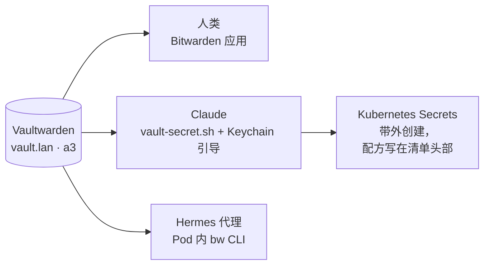

# Vaultwarden：唯一的密钥仓库

**它是什么。** Vaultwarden 是一个轻量的自托管服务器，讲 Bitwarden 协议——所以所有官方 Bitwarden 应用、浏览器扩展和 CLI 都能直接对接它，而数据存在我自己的硬件上。在这个实验室里，它运行在 a3 节点，服务地址是 `https://vault.lan`。

**为什么我推荐它。** 家庭实验室生产凭据的速度快得吓人：管理员密码、API token、机器人账号、bot token、加密密钥。没有一个统一的存放处，它们就会散落在 shell 历史、便利贴和你迟早会弄丢的 gitignore 文件里。Vaultwarden 给了我的实验室一个统一的密钥叙事——而意外的红利是，它让这个实验室**可以被 AI 代理操作**：一个有保险库访问权的代理，可以在任务需要的那一刻取到任何凭据，而不用停下来问我。

**看看它长什么样。**

{/* screenshot: platform/vaultwarden-vault.png — the web vault, Automation collection visible, values redacted */}

**每天有什么流经它：**

- 我自己的各种登录，走手机和笔记本上的普通 Bitwarden 应用
- 代理的每一次取凭据：`scripts/vault-secret.sh <item>` 在内存中取值并直接管道给需要它的命令——从来不落盘
- 每一个 Kubernetes Secret：它们全部由保险库中的值*带外*创建，而且每份清单的头部注释都写明了自己的重建配方——就算集群全没了，也能靠保险库把每个 Secret 重新铸造出来
- Hermes 代理在 Pod 内的 `vault-secret` 之手——没错，家里*另一个* AI 也有保险库访问权

**它是这样接线的：**

**我真正踩过的坑：** 如何安全地给一个*代理*授权。答案是一个只限定到单个集合的专用机器人账号、放在 macOS Keychain 里的引导凭据，外加严格的条目命名规则——完整的故事（包括那个曾让所有以 `forgejo…` 开头的条目集体罢工的子串匹配陷阱）写在[信任织物](../tissue/trust-fabric.md)里。

**坦白地说清风险：** 整个保险库就是一个 **760 KB 的 SQLite 文件**。它是集群里最珍贵的 760 KB——丢了它，其他所有恢复流程都会跟着一起死。这就是为什么它是每晚[备份系统](./backups.md)的第一号目标，也是唯一真正演练过恢复的对象：解密、`integrity_check: ok`、每条凭据都可读。
