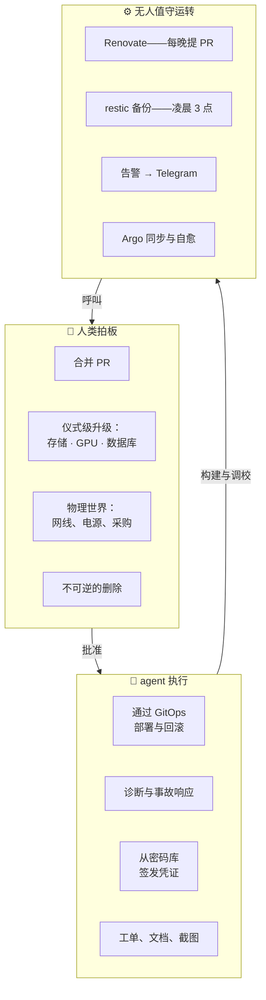

# 委托阶梯

**这是什么：** 这个实验室*由* AI agent *与*人类共同运维，而且它的架构对此毫不遮掩。每一类工作都位于阶梯的某一级：只有我来拍板的事、agent 来执行的事，以及完全无人值守自动运转的事。真正有意思的工程不在任何单独一级上——而在层级之间的护栏里。

**为什么新人需要了解：** 如果你好奇"AI 运维的基础设施"在实践中到底长什么样，答案不是"AI 包办一切"。它是一份深思熟虑的契约，而这个页面就是这份契约的文字版。

## 最高一级：人类拍板的事

合并 pull request 是这个实验室最基本的"同意"动作——没有合并，什么都不会部署。除此之外，还有三类变更被特意设了闸门，让它们*永远不可能*装成日常更新混进来。每道闸门都以教会我们这一课的事故命名：

- **`storage-ceremony`** —— 存储层的升级是有序且单向的；一次失败的升级砸掉的不是仪表盘，而是*数据卷*。
- **`gpu-ceremony`** —— 有一次 GPU 底层组件的版本更新，在一个看起来人畜无害的版本号差异里藏了两个破坏性变更，修了三次才落地。
- **`db-ceremony`** —— 一次 Postgres 大版本升级像普通 PR 一样被合并，九十秒后照片数据库应声倒地——因为数据库的数据目录无法跨大版本使用。

这些闸门写在更新机器人的配置里：高风险更新必须先有人郑重地勾一个复选框，对应的 PR 才会*存在*。人类还负责一切物理世界的事（曾有一台笔记本节点半夜挂掉，原因是电源线被拔了——多少 YAML 都修不了这个），以及所有不可逆的删除。

## 中间一级：agent 执行的事

一切可逆的事。部署走 GitOps，所以 agent 发布变更的本质是 agent 提交了一个 commit——可审计、可回滚、平平无奇。但这一级真正的价值体现在事故中：

## 最低一级：所有人睡觉时运转的事

夜班阵容：更新机器人早上 6 点提 PR；加密备份凌晨 3 点运行；告警发往 Telegram，并在邮件收集器里留一份书面存档；GitOps 控制器持续修复漂移。这一级的设计铁律：无人值守的东西只能**提议和保护**，绝不*决定*——备份不能删数据，更新机器人不能自己合并，而自愈功能恰恰对自动化自身依赖的那几个服务是关闭的。

## 说句实话

这道阶梯不是 AI 能力的上限——它本身就是*产品*。每道闸门都铭刻着一道真实的伤疤；每条层级边界都源自同一个问题："如果这件事无人值守地出错，最坏会发生什么？"然后把决定权放在爆炸半径指示的位置。
