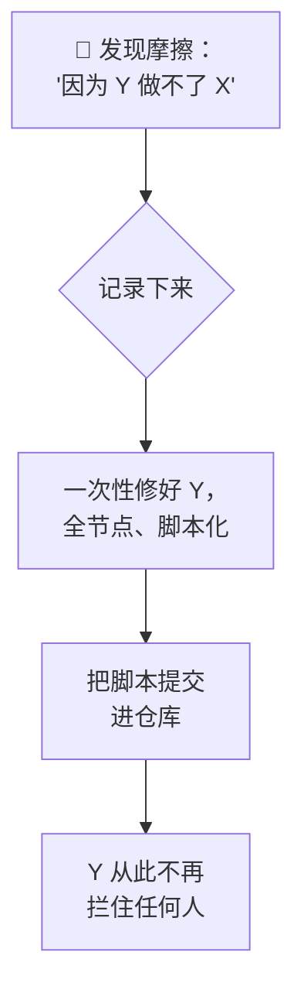

# 官僚作风清除主义

**这是什么：** "官僚作风"（red tape）是我对每一个这样的瞬间的称呼：运维者——无论是人还是 AI——说出*"因为 Y，所以我做不了 X"*。一个 sudo 密码提示。一张不受信任的 TLS 证书。一份只存在于某人脑子里的凭证。一份只在某一台笔记本上有效的配置。单看每一件只浪费三十秒；加在一起就是凌迟。某一周，我专门跑了一场冲刺，把它们全部干掉。

**为什么重要：** 每一处官僚作风都是自动化的死亡之地。agent 撞上密码提示时不会变慢——它会*直接停下*。这场冲刺的核心洞察是：agent 的摩擦清单和人类的摩擦清单，其实是同一张清单。清一次，人人受益。

## 主义精髓

所有问题都用同一套办法处理：找到摩擦，*一次性在所有地方*修好，再把修复方案写成幂等脚本提交进仓库，这样重建之后依然有效。这场冲刺的高光时刻：

- **全节点免密 sudo**（`scripts/node-sudoers.sh`）。SSH 本来就只认密钥，所以加一条 `NOPASSWD` 配置并没有改变任何真实的安全边界——它只是让节点级操作终于可以无人值守地跑完。
- **信任无处不在**（`scripts/trust-lan-ca.sh`）：把内部 CA 装进每个节点的操作系统信任库，再配上 split DNS，让每台机器都能解析实验室的 `.lan` 域名。在此之前，只有笔记本能正常访问各项服务——那台笔记本就是一个由"信任"构成的单点故障。
- **密码库补全：** 让每一份凭证都真正*进入*密码库（见[信任织物](/tissue/trust-fabric)），从此"密码在某个地方"不再是一类拦路虎。
- **节点卫生**（`scripts/node-powersave.sh`）：不许睡眠、不许合盖误触、不许 WiFi 省电。这一项立刻回本——有个节点的 WiFi 省电模式竟然是**开着的**，这解释了它好几个月来神秘掉线的原因。
- **备份**（[完整故事在这里](/platform/backups)）——因为最深层的官僚作风莫过于"这个不能试，万一数据丢了呢"。

## 北极星验收测试

这场冲刺有一条验收标准，直到今天我仍然用它来衡量每一个改动：

> 一台全新的机器——只要有这个仓库、密码库和 SSH 密钥——就能以有效的 TLS 访问所有 `.lan` 服务、无人值守地执行节点操作、签发或轮换任意凭证，并在 30 分钟内重建整套运维工具链。

这句话悄悄浓缩了全部哲学：*笔记本*不是运维者。*仓库加密码库*才是运维者。任何一台机器——或任何一个 agent——只要拿到这两样东西，就能运转这个实验室。

## 它到底改变了什么

冲刺之前，摆弄这个实验室意味着脑子里得装一张地图：哪台机器信任什么、哪个密码放在哪里、哪台节点会干到一半睡着。冲刺之后，这个实验室变成了那种 AI agent 可以在半夜领一张工单并把它做完的系统——因为从工单到修复之间，再没有任何环节会提出只有坐在键盘前的人类才能回答的问题。
