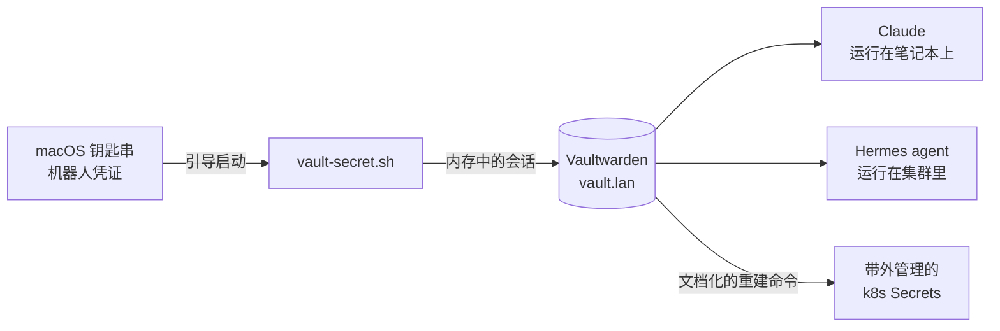

# 信任织物

**这是什么：** 这个实验室里的每一份凭证——API token、管理员密码、机器人密钥，全部——都只存放在一个地方：一套自托管的 [Vaultwarden](/platform/vaultwarden)。读取靠一个脚本，写入靠另一个脚本。除此之外，任何东西都不允许成为"事实来源"。

**我为什么需要它：** 家庭实验室会悄悄积累几十个密码，而每个密码的默认归宿要么是 shell 历史记录，要么是便利贴，最糟的是进了公开的 git 仓库。但还有第二个原因，事后证明更加重要：**这个实验室由 AI agent 协助运维**，而如果每个任务都以"然后我停下来了，因为我没有密码"收场，agent 就干不了真正的活。信任织物正是让我的 agent 从一个 YAML 生成器变成一名运维工程师的关键。

{/* screenshot: vaultwarden/collection.png — the Automation collection item list (names only, no values) */}

## 它是如何运作的

各个组件，按它们发挥作用的顺序：

- **`scripts/vault-secret.sh <item> [field]`** 精确读取一份密钥并打印到 stdout。它用一个专用*机器人账号*登录（凭证保存在 macOS 钥匙串里），在内存会话中解锁密码库，取值，然后退出。任何敏感内容都不会落盘。它的姊妹脚本 `vault-put.sh` 以同样的方式写入——值通过 stdin 传入，绝不作为命令行参数。
- **机器人账号**只能看到一个集合（`Automation`）——永远碰不到我的个人密码库。把实验室的钥匙交给 agent，并不意味着把我生活的钥匙也交出去。
- **Kubernetes Secret 采用"带外"管理，但绝不"脱离记录"：** 每一个需要 Secret 的 manifest 都在文件头部写明了完整的重建命令，而且值一律从密码库读取。就算集群没了，只要密码库还在，每个 Secret 都能靠复制粘贴重新生成。

## agent 获得"双手"的时刻

转折点是我们决定让 Claude——以及后来集群内的 agent [Hermes](/ai/hermes)——*亲自*获取凭证。Hermes 在它的 pod 里运行 Bitwarden CLI，用的是同一个机器人账号，外面包了一层规则严格的 skill：用时才取、绝不打印完整密钥、用元数据证明访问成功（长度、前缀、一个 HTTP 200），而不是打印值本身。

这一步走通之后，一大批杂务瞬间消失了：签发 Forgejo token、轮换 Harbor 密码、给新服务接管理员凭证——全都变成了"一条命令，直取密码库"，无论敲键盘的是人还是 agent。

## 托管密钥的微妙之处

有一份凭证被刻意存放在*两个*地方。restic 备份密码既在 Vaultwarden 里，**也**在 macOS 钥匙串里——因为 Vaultwarden 本身就是被备份的对象之一，而一把只存在于保险箱内部的、用来打开这个保险箱的钥匙，是个谜语，不是托管。在这里，循环依赖都会被有意识地打破，[备份页面](/platform/backups)讲述了这个故事的后半段。

## 我每天实际用它做什么

- 一行命令取出任意服务的凭证——`scripts/vault-secret.sh grafana-admin`——不用离开终端
- 让 agent 自行签发、存储、使用各种 token（Forgejo、Harbor、Telegram、HuggingFace……），全程不需要往聊天里粘贴任何密钥
- 按 manifest 头部的配方重新生成任意 Kubernetes Secret
- 安心睡觉，因为公开仓库里**零**密钥——即便如此，提交前的泄漏扫描照样会跑
